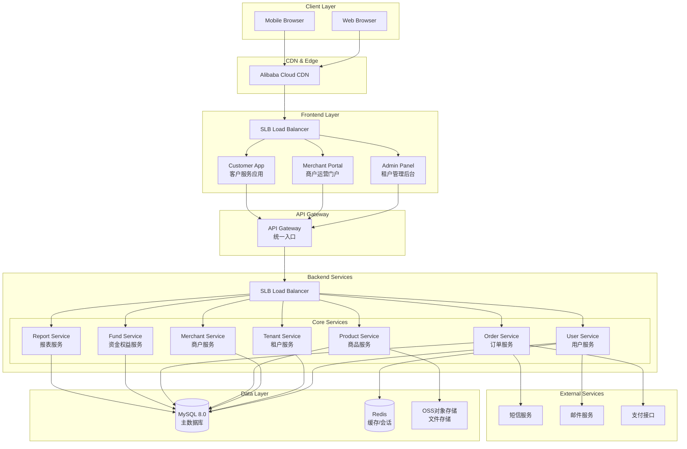
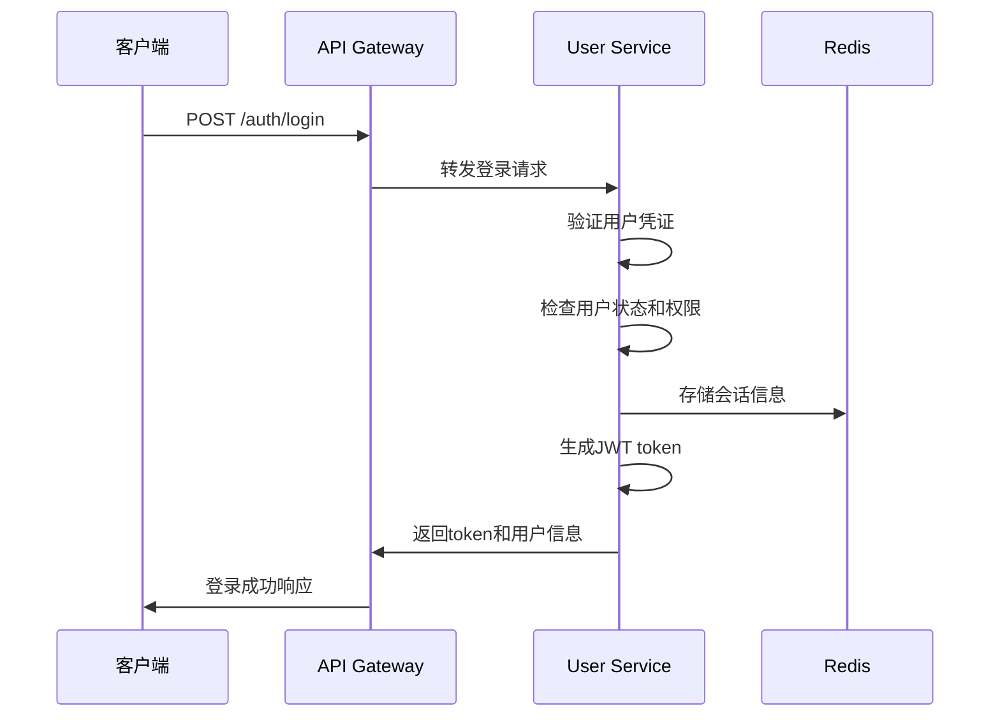
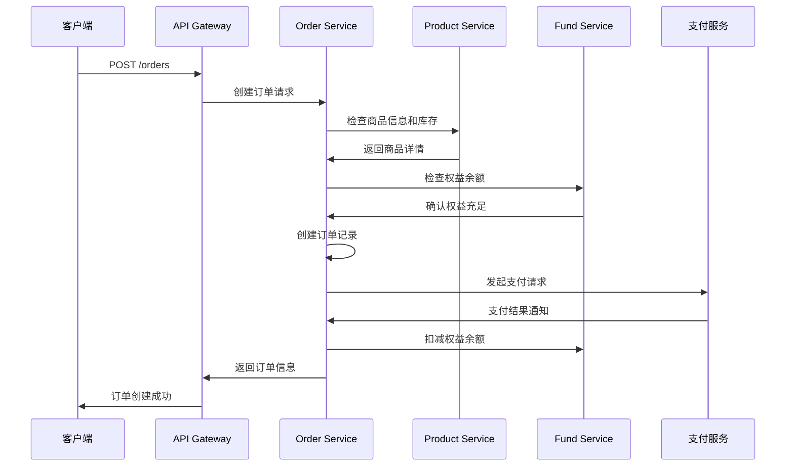
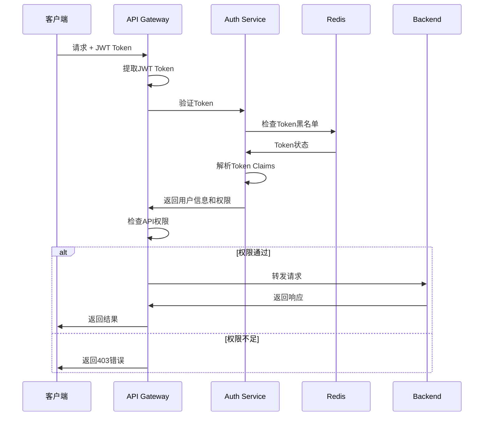
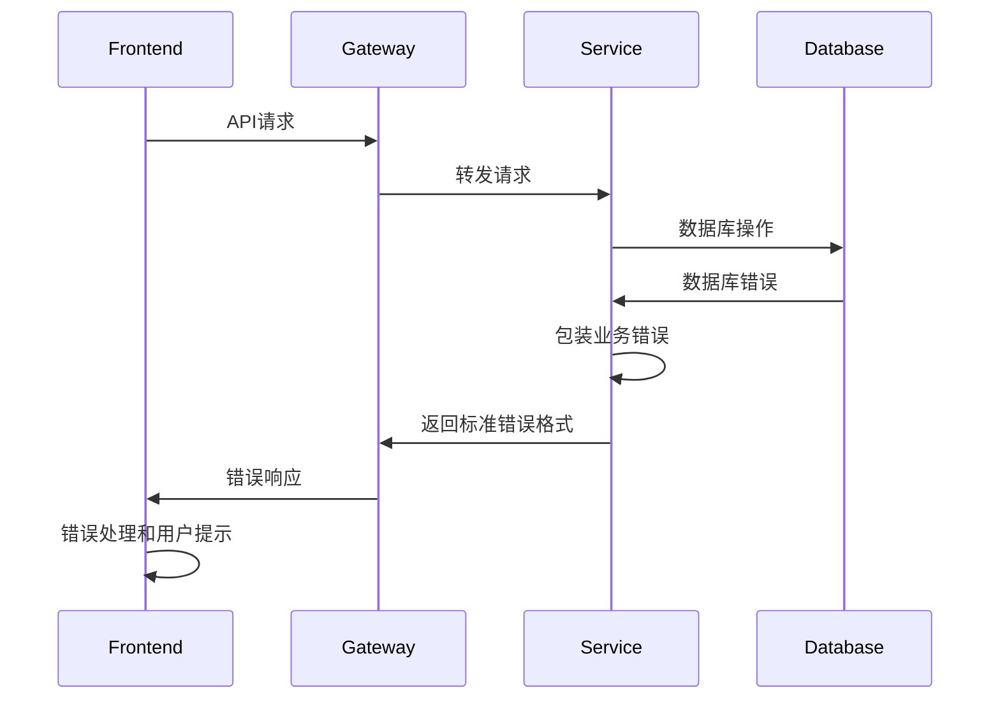

# 多租户商户管理SaaS系统 Fullstack Architecture Document

## Introduction

这份文档概述了多租户商户管理SaaS系统的完整全栈架构，包括后端系统、前端实现及其集成。它作为AI驱动开发的唯一真实来源，确保整个技术栈的一致性。

这种统一的方法结合了传统上独立的后端和前端架构文档，为现代全栈应用简化了开发流程，因为这些关注点越来越相互关联。

### Starter Template or Existing Project

**项目类型**: 绿地项目（Greenfield project）- 基于你的PRD和用户服务设计从零开始构建

**技术约束**:
- 必须使用Go + GoFrame框架的DDD架构
- 前端必须使用React + Amis低代码框架
- 数据库使用MySQL，不使用外键约束
- 支持三层B2B2C用户架构（租户-商户-客户）

**架构原则**:
- 多租户数据隔离通过应用层控制
- 微服务按业务领域划分
- 前后端分离但集成紧密

### Change Log

| Date | Version | Description | Author |
|------|---------|-------------|---------|
| 2025-01-15 | 1.0 | 初始全栈架构设计，基于PRD和用户服务设计创建 | Winston (Architect) |

## High Level Architecture

### Technical Summary

多租户商户管理SaaS系统采用微服务架构，使用Go+GoFrame构建领域驱动的后端服务，React+Amis构建多层级管理前端。系统通过RESTful API实现前后端分离，使用MySQL存储业务数据，Redis提供缓存和会话管理。基于Docker容器化部署到云平台，支持水平扩展。该架构实现了三层B2B2C用户体系的完整业务流程，从租户管理到商户运营再到客户服务，确保数据隔离、权限控制和高性能访问。

### Platform and Infrastructure Choice

**Platform**: 阿里云  
**Key Services**: ECS集群、RDS MySQL、Redis、OSS对象存储、SLB负载均衡、CDN加速  
**Deployment Host and Regions**: 华东2（上海）主区域，华北2（北京）灾备区域

### Repository Structure

**Structure**: Monorepo  
**Monorepo Tool**: Go workspace (后端) + npm workspaces (前端)  
**Package Organization**: 按领域服务分离，共享代码独立包管理

### High Level Architecture Diagram



### Architectural Patterns

- **DDD (Domain-Driven Design)**: 按业务领域组织代码结构，清晰的聚合根和实体边界 - _理由:_ 复杂业务逻辑需要清晰的领域建模
- **微服务架构**: 按业务能力拆分独立服务，支持独立部署和扩展 - _理由:_ 三层用户架构需要不同的扩展策略和开发节奏
- **CQRS模式**: 读写分离，优化查询性能 - _理由:_ 报表查询和业务操作有不同的性能要求
- **事件驱动架构**: 服务间通过领域事件松耦合通信 - _理由:_ 减少服务间直接依赖，提高系统弹性
- **API网关模式**: 统一API入口，处理认证、限流和路由 - _理由:_ 简化前端调用，统一安全策略
- **Repository模式**: 抽象数据访问层，支持测试和数据源切换 - _理由:_ 提高代码可测试性和可维护性
- **多租户单库模式**: 通过tenant_id实现数据隔离 - _理由:_ 平衡数据隔离和运维复杂度

## Tech Stack

### Technology Stack Table

| Category | Technology | Version | Purpose | Rationale |
|----------|------------|---------|---------|-----------|
| Frontend Language | TypeScript | 5.3+ | 类型安全的前端开发语言 | 提供类型检查，减少运行时错误，提升开发效率 |
| Frontend Framework | React | 18.2+ | 用户界面构建框架 | 生态成熟，组件化开发，与Amis完美集成 |
| UI Component Library | Amis | 6.0+ | 低代码可视化框架 | 快速构建管理后台界面，减少重复开发 |
| State Management | Zustand | 4.4+ | 轻量级状态管理 | 简单易用，性能优秀，适合中等复杂度应用 |
| Backend Language | Go | 1.21+ | 高性能后端开发语言 | 并发性能优秀，内存安全，编译型语言 |
| Backend Framework | GoFrame | 2.6+ | 企业级应用开发框架 | 完整的DDD支持，丰富的企业级特性 |
| API Style | RESTful | OpenAPI 3.0 | HTTP API设计风格 | 标准化接口，易于理解和集成，支持代码生成 |
| Database | MySQL | 8.0+ | 关系型数据库 | 成熟稳定，事务支持，运维经验丰富 |
| Cache | Redis | 7.0+ | 内存数据库和缓存 | 高性能缓存，会话存储，消息队列 |
| File Storage | Alibaba Cloud OSS | Latest | 对象存储服务 | 海量文件存储，CDN加速，成本可控 |
| Authentication | JWT | RFC 7519 | 无状态身份验证 | 分布式友好，支持跨服务认证 |
| Frontend Testing | Jest + RTL | 29.0+ | 单元和集成测试 | React生态标准，测试覆盖率好 |
| Backend Testing | GoConvey | 1.8+ | Go测试框架 | BDD风格测试，可读性强，报告丰富 |
| E2E Testing | Playwright | 1.40+ | 端到端自动化测试 | 跨浏览器支持，API测试能力强 |
| Build Tool | Vite | 5.0+ | 前端构建工具 | 快速热重载，现代化构建，TypeScript支持 |
| Bundler | Rollup | 4.0+ | 模块打包器 | Vite内置，tree-shaking优秀 |
| IaC Tool | Terraform | 1.6+ | 基础设施即代码 | 云资源管理，版本控制，多云支持 |
| CI/CD | 暂无 | - | 持续集成/部署 | 初期手动部署，后续可选择GitHub Actions或Jenkins |
| Monitoring | Prometheus + Grafana | 2.40+/10.0+ | 监控和可视化 | 开源监控栈，指标丰富，告警完善 |
| Logging | Logrus + ELK | 1.9+/8.0+ | 日志收集和分析 | 结构化日志，集中存储，查询分析 |
| CSS Framework | Tailwind CSS | 3.4+ | 原子化CSS框架 | 快速样式开发，与Amis配合使用 |

## Data Models

### User (用户)

**Purpose:** 统一的用户实体，支持三层B2B2C架构中的所有用户角色

**Key Attributes:**
- id: string - 全局唯一用户标识
- username: string - 用户名，租户内唯一
- email: string - 邮箱地址，全局唯一
- tenant_id: string - 所属租户ID
- roles: UserRole[] - 用户角色列表

#### TypeScript Interface

```typescript
interface User {
  id: string;
  uuid: string;
  username: string;
  email: string;
  phone?: string;
  status: UserStatus;
  tenant_id: string;
  roles: UserRole[];
  profile?: UserProfile;
  created_at: Date;
  updated_at: Date;
  last_login_at?: Date;
}

enum UserStatus {
  PENDING = 'pending',
  ACTIVE = 'active', 
  SUSPENDED = 'suspended',
  DEACTIVATED = 'deactivated'
}

interface UserRole {
  id: string;
  user_id: string;
  role_type: RoleType;
  resource_id?: string;
  permissions: string[];
}
```

#### Relationships

- User belongs to Tenant (多对一)
- User has many UserRoles (一对多)
- User can be associated with Merchant through UserRole (多对多)

### Tenant (租户)

**Purpose:** 多租户架构的核心实体，提供数据隔离和配置管理

#### TypeScript Interface

```typescript
interface Tenant {
  id: string;
  name: string;
  code: string;
  status: TenantStatus;
  config: TenantConfig;
  created_at: Date;
  updated_at: Date;
}

enum TenantStatus {
  ACTIVE = 'active',
  SUSPENDED = 'suspended',
  EXPIRED = 'expired'
}
```

#### Relationships

- Tenant has many Users (一对多)
- Tenant has many Merchants (一对多)

### Merchant (商户)

**Purpose:** 商户实体，B2B2C架构中的运营层核心

#### TypeScript Interface

```typescript
interface Merchant {
  id: string;
  tenant_id: string;
  name: string;
  code: string;
  status: MerchantStatus;
  business_info: BusinessInfo;
  rights_balance: RightsBalance;
  created_at: Date;
  updated_at: Date;
}

interface RightsBalance {
  total_balance: number;
  used_balance: number;
  frozen_balance: number;
}
```

#### Relationships

- Merchant belongs to Tenant (多对一)
- Merchant has many Products (一对多)
- Merchant has many Orders (一对多)

### Product (商品)

**Purpose:** 商品实体，支持商户的商品目录管理和客户浏览购买

#### TypeScript Interface

```typescript
interface Product {
  id: string;
  tenant_id: string;
  merchant_id: string;
  name: string;
  description?: string;
  price: Money;
  rights_cost: number;
  inventory: InventoryInfo;
  status: ProductStatus;
  created_at: Date;
  updated_at: Date;
}

interface Money {
  amount: number;
  currency: string;
}

interface InventoryInfo {
  stock_quantity: number;
  reserved_quantity: number;
  track_inventory: boolean;
}
```

#### Relationships

- Product belongs to Tenant (多对一)
- Product belongs to Merchant (多对一)

### Order (订单)

**Purpose:** 订单实体，完整的交易生命周期管理和核销流程

#### TypeScript Interface

```typescript
interface Order {
  id: string;
  tenant_id: string;
  merchant_id: string;
  customer_id: string;
  order_number: string;
  status: OrderStatus;
  items: OrderItem[];
  payment_info: PaymentInfo;
  verification?: VerificationInfo;
  total_amount: Money;
  total_rights_cost: number;
  created_at: Date;
  updated_at: Date;
}

enum OrderStatus {
  PENDING = 'pending',
  PAID = 'paid', 
  PROCESSING = 'processing',
  COMPLETED = 'completed',
  CANCELLED = 'cancelled'
}

interface VerificationInfo {
  verification_code: string;
  qr_code_url: string;
  verified_at?: Date;
  verified_by?: string;
}
```

#### Relationships

- Order belongs to Tenant, Merchant, Customer (多对一)
- Order has many OrderItems (一对多)

## API Specification

### REST API Specification

```yaml
openapi: 3.0.0
info:
  title: 多租户商户管理SaaS系统 API
  version: 1.0.0
  description: 支持三层B2B2C架构的完整业务API

servers:
  - url: https://api.mer-demo.com/v1
    description: 生产环境API服务器

paths:
  /auth/login:
    post:
      summary: 用户登录
      tags: [Authentication]
      requestBody:
        required: true
        content:
          application/json:
            schema:
              type: object
              properties:
                username:
                  type: string
                password:
                  type: string
                tenant_id:
                  type: string
      responses:
        '200':
          description: 登录成功
          content:
            application/json:
              schema:
                type: object
                properties:
                  access_token:
                    type: string
                  user:
                    $ref: '#/components/schemas/User'

  /users:
    get:
      summary: 获取用户列表
      tags: [Users]
      security:
        - bearerAuth: []
      responses:
        '200':
          description: 用户列表
          content:
            application/json:
              schema:
                type: object
                properties:
                  data:
                    type: array
                    items:
                      $ref: '#/components/schemas/User'

  /merchants:
    get:
      summary: 获取商户列表
      tags: [Merchants]
      security:
        - bearerAuth: []
      responses:
        '200':
          description: 商户列表

  /products:
    get:
      summary: 获取商品列表
      tags: [Products]
      parameters:
        - in: query
          name: merchant_id
          schema:
            type: string
      responses:
        '200':
          description: 商品列表

  /orders:
    post:
      summary: 创建订单
      tags: [Orders]
      security:
        - bearerAuth: []
      requestBody:
        required: true
        content:
          application/json:
            schema:
              type: object
              properties:
                merchant_id:
                  type: string
                items:
                  type: array
                  items:
                    type: object
                    properties:
                      product_id:
                        type: string
                      quantity:
                        type: integer
      responses:
        '201':
          description: 订单创建成功

components:
  securitySchemes:
    bearerAuth:
      type: http
      scheme: bearer
      bearerFormat: JWT
      
  schemas:
    User:
      type: object
      properties:
        id:
          type: string
        username:
          type: string
        email:
          type: string
        status:
          type: string
```

## Components

### API Gateway

**Responsibility:** 统一API入口，处理认证、路由、限流、监控

**Key Interfaces:**
- HTTP请求路由和转发
- JWT token验证
- 请求限流和熔断
- 访问日志和监控

**Dependencies:** 所有后端微服务

**Technology Stack:** Nginx + Lua脚本或Kong API Gateway

### User Service

**Responsibility:** 统一用户管理，支持三层B2B2C用户体系

**Key Interfaces:**
- 用户注册、登录、注销API
- 用户信息CRUD操作
- 角色权限管理
- JWT token生成和验证

**Dependencies:** MySQL, Redis, 邮件服务

**Technology Stack:** Go + GoFrame + GORM

### Tenant Service

**Responsibility:** 多租户管理和配置

**Key Interfaces:**
- 租户注册和配置API
- 租户状态管理
- 多租户隔离策略

**Dependencies:** MySQL, User Service

**Technology Stack:** Go + GoFrame

### Merchant Service

**Responsibility:** 商户生命周期管理

**Key Interfaces:**
- 商户注册审批API
- 商户信息管理
- 商户状态控制

**Dependencies:** MySQL, Tenant Service, User Service

**Technology Stack:** Go + GoFrame

### Product Service

**Responsibility:** 商品目录和库存管理

**Key Interfaces:**
- 商品CRUD操作API
- 库存管理API
- 商品搜索和分类

**Dependencies:** MySQL, OSS, Merchant Service

**Technology Stack:** Go + GoFrame + ElasticSearch

### Order Service

**Responsibility:** 订单处理和核销管理

**Key Interfaces:**
- 订单创建和管理API
- 支付集成接口
- 核销码生成和验证

**Dependencies:** MySQL, Product Service, Fund Service, 支付服务

**Technology Stack:** Go + GoFrame + 第三方支付SDK

### Fund & Rights Service

**Responsibility:** 资金和权益管理

**Key Interfaces:**
- 充值和分配API
- 权益使用和监控
- 财务报表生成

**Dependencies:** MySQL, Merchant Service

**Technology Stack:** Go + GoFrame

### Report Service

**Responsibility:** 数据分析和报表生成

**Key Interfaces:**
- 数据聚合API
- 报表生成和导出
- 实时数据查询

**Dependencies:** MySQL (只读), Redis

**Technology Stack:** Go + GoFrame + ClickHouse

## External APIs

### 阿里云短信服务 API

- **Purpose:** 发送验证码、通知短信
- **Documentation:** https://help.aliyun.com/product/44282.html
- **Base URL:** https://dysmsapi.aliyuncs.com
- **Authentication:** AccessKey/SecretKey签名认证
- **Rate Limits:** 1000条/天（免费额度）

**Key Endpoints Used:**
- `POST /` - 发送短信验证码
- `POST /` - 发送订单通知短信

### 支付宝支付 API

- **Purpose:** 在线支付处理
- **Documentation:** https://opendocs.alipay.com/
- **Base URL:** https://openapi.alipay.com/gateway.do
- **Authentication:** RSA2签名
- **Rate Limits:** 20000笔/天

**Key Endpoints Used:**
- `alipay.trade.create` - 创建交易订单
- `alipay.trade.query` - 查询交易状态

## Core Workflows

### 用户登录流程



### 订单创建流程



## Database Schema

```sql
-- 用户表
CREATE TABLE users (
    id BIGINT UNSIGNED AUTO_INCREMENT PRIMARY KEY,
    uuid VARCHAR(36) NOT NULL UNIQUE,
    username VARCHAR(50) NOT NULL,
    email VARCHAR(100) NOT NULL,
    phone VARCHAR(20),
    password_hash VARCHAR(255) NOT NULL,
    status TINYINT NOT NULL DEFAULT 1,
    tenant_id BIGINT UNSIGNED NOT NULL,
    created_at TIMESTAMP DEFAULT CURRENT_TIMESTAMP,
    updated_at TIMESTAMP DEFAULT CURRENT_TIMESTAMP ON UPDATE CURRENT_TIMESTAMP,
    INDEX idx_tenant_id (tenant_id),
    INDEX idx_email (email),
    INDEX idx_username_tenant (username, tenant_id)
);

-- 租户表
CREATE TABLE tenants (
    id BIGINT UNSIGNED AUTO_INCREMENT PRIMARY KEY,
    name VARCHAR(100) NOT NULL,
    code VARCHAR(50) NOT NULL UNIQUE,
    status TINYINT NOT NULL DEFAULT 1,
    config JSON,
    created_at TIMESTAMP DEFAULT CURRENT_TIMESTAMP,
    updated_at TIMESTAMP DEFAULT CURRENT_TIMESTAMP ON UPDATE CURRENT_TIMESTAMP,
    INDEX idx_code (code),
    INDEX idx_status (status)
);

-- 商户表
CREATE TABLE merchants (
    id BIGINT UNSIGNED AUTO_INCREMENT PRIMARY KEY,
    tenant_id BIGINT UNSIGNED NOT NULL,
    name VARCHAR(100) NOT NULL,
    code VARCHAR(50) NOT NULL,
    status TINYINT NOT NULL DEFAULT 1,
    business_info JSON,
    rights_balance JSON,
    created_at TIMESTAMP DEFAULT CURRENT_TIMESTAMP,
    updated_at TIMESTAMP DEFAULT CURRENT_TIMESTAMP ON UPDATE CURRENT_TIMESTAMP,
    INDEX idx_tenant_id (tenant_id),
    INDEX idx_code_tenant (code, tenant_id)
);

-- 商品表
CREATE TABLE products (
    id BIGINT UNSIGNED AUTO_INCREMENT PRIMARY KEY,
    tenant_id BIGINT UNSIGNED NOT NULL,
    merchant_id BIGINT UNSIGNED NOT NULL,
    name VARCHAR(200) NOT NULL,
    description TEXT,
    price_amount DECIMAL(10,2) NOT NULL,
    price_currency VARCHAR(3) DEFAULT 'CNY',
    rights_cost DECIMAL(10,2) NOT NULL,
    inventory_info JSON,
    status TINYINT NOT NULL DEFAULT 1,
    created_at TIMESTAMP DEFAULT CURRENT_TIMESTAMP,
    updated_at TIMESTAMP DEFAULT CURRENT_TIMESTAMP ON UPDATE CURRENT_TIMESTAMP,
    INDEX idx_tenant_id (tenant_id),
    INDEX idx_merchant_id (merchant_id),
    INDEX idx_status (status)
);

-- 订单表
CREATE TABLE orders (
    id BIGINT UNSIGNED AUTO_INCREMENT PRIMARY KEY,
    tenant_id BIGINT UNSIGNED NOT NULL,
    merchant_id BIGINT UNSIGNED NOT NULL,
    customer_id BIGINT UNSIGNED NOT NULL,
    order_number VARCHAR(50) NOT NULL,
    status TINYINT NOT NULL DEFAULT 1,
    items JSON NOT NULL,
    payment_info JSON,
    verification_info JSON,
    total_amount DECIMAL(10,2) NOT NULL,
    total_rights_cost DECIMAL(10,2) NOT NULL,
    created_at TIMESTAMP DEFAULT CURRENT_TIMESTAMP,
    updated_at TIMESTAMP DEFAULT CURRENT_TIMESTAMP ON UPDATE CURRENT_TIMESTAMP,
    INDEX idx_tenant_id (tenant_id),
    INDEX idx_merchant_id (merchant_id),
    INDEX idx_customer_id (customer_id),
    INDEX idx_order_number (order_number),
    INDEX idx_status (status)
);
```

## Frontend Architecture

### Component Architecture

#### Component Organization

```
src/
├── components/           # 通用组件
│   ├── ui/              # 基础UI组件
│   ├── forms/           # 表单组件
│   └── layouts/         # 布局组件
├── pages/               # 页面组件
│   ├── tenant/          # 租户管理页面
│   ├── merchant/        # 商户管理页面
│   ├── customer/        # 客户页面
│   └── auth/            # 认证页面
├── hooks/               # 自定义Hooks
├── services/            # API服务层
├── stores/              # 状态管理
├── utils/               # 工具函数
└── types/               # TypeScript类型定义
```

#### Component Template

```typescript
import React from 'react';
import { Card } from '@/components/ui';
import { useAuth } from '@/hooks';
import type { User } from '@/types';

interface UserCardProps {
  user: User;
  onEdit?: (user: User) => void;
}

export const UserCard: React.FC<UserCardProps> = ({ user, onEdit }) => {
  const { hasPermission } = useAuth();

  return (
    <Card>
      <div className="p-4">
        <h3>{user.username}</h3>
        <p>{user.email}</p>
        {hasPermission('user:edit') && (
          <button onClick={() => onEdit?.(user)}>编辑</button>
        )}
      </div>
    </Card>
  );
};
```

### State Management Architecture

#### State Structure

```typescript
interface AppState {
  auth: AuthState;
  tenant: TenantState;
  merchants: MerchantState;
  products: ProductState;
  orders: OrderState;
  ui: UIState;
}

interface AuthState {
  user: User | null;
  token: string | null;
  permissions: string[];
  isLoading: boolean;
}

interface MerchantState {
  current: Merchant | null;
  list: Merchant[];
  isLoading: boolean;
  filters: MerchantFilters;
}
```

#### State Management Patterns

- 使用Zustand进行全局状态管理
- 按功能模块分离store
- 使用immer进行不可变更新
- 实现乐观更新提升用户体验

### Routing Architecture

#### Route Organization

```
/
├── /auth/login          # 登录页面
├── /auth/register       # 注册页面
├── /dashboard           # 仪表板
├── /tenant/             # 租户管理
│   ├── /settings        # 租户设置
│   └── /merchants       # 商户管理
├── /merchant/           # 商户门户
│   ├── /products        # 商品管理
│   ├── /orders          # 订单管理
│   └── /reports         # 报表分析
└── /customer/           # 客户应用
    ├── /products        # 商品浏览
    ├── /orders          # 订单中心
    └── /profile         # 个人中心
```

#### Protected Route Pattern

```typescript
import { Navigate, useLocation } from 'react-router-dom';
import { useAuth } from '@/hooks';

interface ProtectedRouteProps {
  children: React.ReactNode;
  requiredRole?: string;
  requiredPermission?: string;
}

export const ProtectedRoute: React.FC<ProtectedRouteProps> = ({
  children,
  requiredRole,
  requiredPermission
}) => {
  const { user, hasRole, hasPermission } = useAuth();
  const location = useLocation();

  if (!user) {
    return <Navigate to="/auth/login" state={{ from: location }} />;
  }

  if (requiredRole && !hasRole(requiredRole)) {
    return <Navigate to="/unauthorized" />;
  }

  if (requiredPermission && !hasPermission(requiredPermission)) {
    return <Navigate to="/forbidden" />;
  }

  return <>{children}</>;
};
```

### Frontend Services Layer

#### API Client Setup

```typescript
import axios from 'axios';
import { useAuthStore } from '@/stores';

const apiClient = axios.create({
  baseURL: process.env.REACT_APP_API_URL || 'http://localhost:8080/api/v1',
  timeout: 10000,
});

// 请求拦截器
apiClient.interceptors.request.use((config) => {
  const token = useAuthStore.getState().token;
  if (token) {
    config.headers.Authorization = `Bearer ${token}`;
  }
  return config;
});

// 响应拦截器
apiClient.interceptors.response.use(
  (response) => response.data,
  (error) => {
    if (error.response?.status === 401) {
      useAuthStore.getState().logout();
    }
    return Promise.reject(error);
  }
);
```

#### Service Example

```typescript
import { apiClient } from '@/lib/api';
import type { User, CreateUserRequest } from '@/types';

export const userService = {
  async getUsers(): Promise<User[]> {
    const response = await apiClient.get('/users');
    return response.data;
  },

  async createUser(user: CreateUserRequest): Promise<User> {
    const response = await apiClient.post('/users', user);
    return response.data;
  },

  async updateUser(id: string, user: Partial<User>): Promise<User> {
    const response = await apiClient.put(`/users/${id}`, user);
    return response.data;
  },

  async deleteUser(id: string): Promise<void> {
    await apiClient.delete(`/users/${id}`);
  },
};
```

## Backend Architecture

### Service Architecture

#### Controller Organization

```
backend/
├── cmd/                 # 应用入口
│   ├── api/            # API服务入口
│   └── worker/         # 后台任务入口
├── internal/           # 内部代码
│   ├── controller/     # HTTP控制器
│   ├── service/        # 业务服务层
│   ├── repository/     # 数据访问层
│   ├── model/          # 数据模型
│   └── middleware/     # 中间件
├── pkg/                # 可复用包
│   ├── auth/          # 认证组件
│   ├── cache/         # 缓存组件
│   └── database/      # 数据库组件
└── api/                # API文档
```

#### Controller Template

```go
package controller

import (
    "context"
    "net/http"
    
    "github.com/gogf/gf/v2/frame/g"
    "github.com/gogf/gf/v2/net/ghttp"
    
    "mer-demo/internal/service"
    "mer-demo/internal/model"
)

type UserController struct {
    userService service.IUserService
}

func NewUserController() *UserController {
    return &UserController{
        userService: service.User(),
    }
}

func (c *UserController) Create(r *ghttp.Request) {
    var req *model.CreateUserRequest
    if err := r.Parse(&req); err != nil {
        r.Response.WriteJsonExit(g.Map{
            "code": 400,
            "message": err.Error(),
        })
        return
    }

    user, err := c.userService.Create(r.Context(), req)
    if err != nil {
        r.Response.WriteJsonExit(g.Map{
            "code": 500,
            "message": err.Error(),
        })
        return
    }

    r.Response.WriteJsonExit(g.Map{
        "code": 0,
        "data": user,
    })
}
```

### Database Architecture

#### Schema Design

参见前面的Database Schema部分。

#### Data Access Layer

```go
package repository

import (
    "context"
    "github.com/gogf/gf/v2/database/gdb"
    "mer-demo/internal/model"
)

type IUserRepository interface {
    Create(ctx context.Context, user *model.User) error
    GetByID(ctx context.Context, id uint64) (*model.User, error)
    GetByEmail(ctx context.Context, email string) (*model.User, error)
    Update(ctx context.Context, user *model.User) error
    Delete(ctx context.Context, id uint64) error
    List(ctx context.Context, req *model.ListUsersRequest) ([]*model.User, int, error)
}

type userRepository struct {
    db gdb.DB
}

func NewUserRepository() IUserRepository {
    return &userRepository{
        db: g.DB(),
    }
}

func (r *userRepository) Create(ctx context.Context, user *model.User) error {
    _, err := r.db.Model("users").Ctx(ctx).Insert(user)
    return err
}

func (r *userRepository) GetByID(ctx context.Context, id uint64) (*model.User, error) {
    var user *model.User
    err := r.db.Model("users").Ctx(ctx).Where("id", id).Scan(&user)
    return user, err
}
```

### Authentication and Authorization

#### Auth Flow



#### Middleware/Guards

```go
package middleware

import (
    "strings"
    "github.com/gogf/gf/v2/net/ghttp"
    "github.com/gofromzero/mer-sys/backend/pkg/auth"
)

func AuthMiddleware() ghttp.HandlerFunc {
    return func(r *ghttp.Request) {
        // 跳过认证的路径
        if isPublicPath(r.URL.Path) {
            r.Middleware.Next()
            return
        }

        // 提取JWT Token
        authHeader := r.Header.Get("Authorization")
        if !strings.HasPrefix(authHeader, "Bearer ") {
            r.Response.WriteStatusExit(401, "Missing or invalid token")
            return
        }

        token := strings.TrimPrefix(authHeader, "Bearer ")
        
        // 验证Token
        claims, err := auth.ValidateToken(token)
        if err != nil {
            r.Response.WriteStatusExit(401, "Invalid token")
            return
        }

        // 设置用户上下文
        r.SetCtxVar("user_id", claims.UserID)
        r.SetCtxVar("tenant_id", claims.TenantID)
        r.SetCtxVar("permissions", claims.Permissions)

        r.Middleware.Next()
    }
}

func isPublicPath(path string) bool {
    publicPaths := []string{
        "/api/v1/auth/login",
        "/api/v1/auth/register", 
        "/api/v1/health",
    }
    
    for _, publicPath := range publicPaths {
        if strings.HasPrefix(path, publicPath) {
            return true
        }
    }
    return false
}
```

## Unified Project Structure

```
mer-demo/
├── .github/                    # CI/CD workflows (预留)
├── backend/                    # Go workspace根目录
│   ├── go.work                # Go workspace配置
│   ├── shared/                # 共享包
│   │   ├── types/             # 共享类型定义
│   │   ├── constants/         # 常量定义
│   │   ├── utils/             # 工具函数
│   │   └── middleware/        # 共享中间件
│   ├── services/              # 微服务
│   │   ├── user-service/      # 用户服务
│   │   ├── tenant-service/    # 租户服务
│   │   ├── merchant-service/  # 商户服务
│   │   ├── product-service/   # 商品服务
│   │   ├── order-service/     # 订单服务
│   │   ├── fund-service/      # 资金权益服务
│   │   └── report-service/    # 报表服务
│   ├── gateway/               # API网关
│   └── scripts/               # 构建部署脚本
├── frontend/                  # 前端项目集合
│   ├── admin-panel/           # 租户管理后台
│   │   ├── src/
│   │   │   ├── components/    # 组件
│   │   │   ├── pages/         # 页面
│   │   │   ├── hooks/         # Hooks
│   │   │   ├── services/      # API服务
│   │   │   ├── stores/        # 状态管理
│   │   │   └── utils/         # 工具函数
│   │   ├── public/            # 静态资源
│   │   └── package.json
│   ├── merchant-portal/       # 商户运营门户
│   │   └── src/               # 类似结构
│   ├── customer-app/          # 客户服务应用
│   │   └── src/               # 类似结构
│   └── shared/                # 前端共享包
│       ├── components/        # 共享组件
│       ├── types/             # TypeScript类型
│       ├── utils/             # 工具函数
│       └── hooks/             # 共享Hooks
├── infrastructure/            # 基础设施配置
│   ├── terraform/             # Terraform配置
│   ├── docker/                # Docker配置
│   └── k8s/                   # Kubernetes配置
├── docs/                      # 项目文档
│   ├── prd.md                 # 产品需求文档
│   ├── user-service-design.md # 用户服务设计
│   └── architecture.md        # 本架构文档
├── scripts/                   # 项目脚本
│   ├── dev.sh                 # 开发环境启动
│   ├── build.sh               # 构建脚本
│   └── deploy.sh              # 部署脚本
├── .env.example               # 环境变量模板
├── docker-compose.yml         # 开发环境Docker编排
├── package.json               # 根package.json (npm workspaces)
└── README.md                  # 项目说明
```

## Development Workflow

### Local Development Setup

#### Prerequisites

```bash
# 安装Go 1.21+
curl -LO https://go.dev/dl/go1.21.linux-amd64.tar.gz
sudo tar -C /usr/local -xzf go1.21.linux-amd64.tar.gz

# 安装Node.js 18+
curl -fsSL https://deb.nodesource.com/setup_18.x | sudo -E bash -
sudo apt-get install -y nodejs

# 安装Docker和Docker Compose
sudo apt-get update
sudo apt-get install docker.io docker-compose

# 安装MySQL 8.0
sudo apt-get install mysql-server-8.0
```

#### Initial Setup

```bash
# 克隆项目
git clone <repository-url>
cd mer-demo

# 安装前端依赖
npm install

# 初始化Go workspace
cd backend
go work init
go work use ./shared ./services/user-service ./services/tenant-service

# 启动开发环境数据库
docker-compose up -d mysql redis

# 运行数据库迁移
cd services/user-service
go run cmd/migrate/main.go
```

#### Development Commands

```bash
# 启动所有服务 (使用脚本)
./scripts/dev.sh

# 启动前端开发服务器
cd frontend/admin-panel
npm run dev

# 启动特定后端服务
cd backend/services/user-service
go run cmd/api/main.go

# 运行测试
# 后端测试
cd backend
go test ./...

# 前端测试
cd frontend/admin-panel
npm run test
```

### Environment Configuration

#### Required Environment Variables

```bash
# MySQL配置
DB_HOST=localhost
DB_PORT=3306
DB_NAME=mer_demo
DB_USER=root
DB_PASSWORD=password

# Redis配置
REDIS_HOST=localhost
REDIS_PORT=6379
REDIS_PASSWORD=

# JWT配置
JWT_SECRET=your-secret-key
JWT_EXPIRES_IN=24h

# 阿里云配置
ALIYUN_ACCESS_KEY_ID=your-access-key
ALIYUN_ACCESS_KEY_SECRET=your-secret-key
ALIYUN_OSS_ENDPOINT=https://oss-cn-hangzhou.aliyuncs.com
ALIYUN_OSS_BUCKET=mer-demo-files

# 应用配置
APP_ENV=development
APP_PORT=8080
APP_DEBUG=true
```

## Deployment Architecture

### Deployment Strategy

**Frontend Deployment:**
- **Platform:** 阿里云OSS + CDN
- **Build Command:** npm run build
- **Output Directory:** dist/
- **CDN/Edge:** 阿里云CDN全球加速

**Backend Deployment:**
- **Platform:** 阿里云ECS + Docker
- **Build Command:** go build
- **Deployment Method:** Docker容器部署

### Environments

| Environment | Frontend URL | Backend URL | Purpose |
|-------------|--------------|-------------|---------|
| Development | http://localhost:3000 | http://localhost:8080 | 本地开发环境 |
| Staging | https://staging.mer-demo.com | https://api-staging.mer-demo.com | 预发布测试环境 |
| Production | https://mer-demo.com | https://api.mer-demo.com | 生产环境 |

## Security and Performance

### Security Requirements

**Frontend Security:**
- CSP Headers: 严格的内容安全策略，防止XSS攻击
- XSS Prevention: 输入验证和输出转义，使用React的内置防护
- Secure Storage: JWT存储在httpOnly cookie中，敏感数据不存储在localStorage

**Backend Security:**
- Input Validation: 所有API输入使用GoFrame的验证器进行严格验证
- Rate Limiting: API Gateway层面实现请求限流，防止DDoS攻击
- CORS Policy: 严格的跨域策略，只允许白名单域名访问

**Authentication Security:**
- Token Storage: JWT使用RS256算法签名，token存储在安全cookie中
- Session Management: 使用Redis存储会话，支持token黑名单机制
- Password Policy: 密码长度不少于8位，包含大小写字母、数字和特殊字符

### Performance Optimization

**Frontend Performance:**
- Bundle Size Target: 主bundle大小控制在500KB以内
- Loading Strategy: 路由懒加载，组件按需导入
- Caching Strategy: 静态资源使用CDN缓存，API响应使用SWR缓存

**Backend Performance:**
- Response Time Target: API平均响应时间控制在200ms以内
- Database Optimization: 合理使用索引，慢查询监控和优化
- Caching Strategy: 热点数据使用Redis缓存，缓存命中率90%以上

## Testing Strategy

### Testing Pyramid

```
            E2E Tests (10%)
           /              \
      Integration Tests (20%)
     /                        \
Frontend Unit (35%)    Backend Unit (35%)
```

### Test Organization

#### Frontend Tests

```
src/
├── __tests__/              # 测试文件
│   ├── components/         # 组件测试
│   ├── hooks/              # Hook测试
│   ├── services/           # 服务测试
│   └── utils/              # 工具函数测试
├── __mocks__/              # Mock文件
└── test-utils/             # 测试工具
```

#### Backend Tests

```
services/user-service/
├── test/
│   ├── unit/               # 单元测试
│   ├── integration/        # 集成测试
│   └── fixtures/           # 测试数据
└── internal/
    └── *_test.go           # 测试文件
```

#### E2E Tests

```
e2e/
├── specs/                  # 测试用例
├── fixtures/               # 测试数据
├── pages/                  # 页面对象
└── utils/                  # 测试工具
```

### Test Examples

#### Frontend Component Test

```typescript
import { render, screen, fireEvent } from '@testing-library/react';
import { UserCard } from '@/components/UserCard';

describe('UserCard', () => {
  const mockUser = {
    id: '1',
    username: 'test-user',
    email: 'test@example.com'
  };

  it('should render user information', () => {
    render(<UserCard user={mockUser} />);
    
    expect(screen.getByText('test-user')).toBeInTheDocument();
    expect(screen.getByText('test@example.com')).toBeInTheDocument();
  });

  it('should call onEdit when edit button clicked', () => {
    const onEdit = jest.fn();
    render(<UserCard user={mockUser} onEdit={onEdit} />);
    
    fireEvent.click(screen.getByText('编辑'));
    expect(onEdit).toHaveBeenCalledWith(mockUser);
  });
});
```

#### Backend API Test

```go
func TestUserController_Create(t *testing.T) {
    // 设置测试环境
    app := gtest.NewApp()
    defer app.Stop()
    
    // 创建测试请求
    req := &model.CreateUserRequest{
        Username: "test-user",
        Email:    "test@example.com",
        Password: "password123",
        TenantID: 1,
    }
    
    // 发送请求
    resp := app.POST("/api/v1/users").JSON(req).Exec()
    
    // 验证响应
    resp.AssertStatus(201)
    resp.AssertJsonPath("$.data.username", "test-user")
}
```

#### E2E Test

```typescript
import { test, expect } from '@playwright/test';

test('user login flow', async ({ page }) => {
  // 导航到登录页面
  await page.goto('/auth/login');
  
  // 填写登录表单
  await page.fill('input[name="username"]', 'admin');
  await page.fill('input[name="password"]', 'password');
  
  // 点击登录按钮
  await page.click('button[type="submit"]');
  
  // 验证登录成功
  await expect(page).toHaveURL('/dashboard');
  await expect(page.locator('text=欢迎回来')).toBeVisible();
});
```

## Coding Standards

### Critical Fullstack Rules

- **Type Sharing:** 所有数据类型必须定义在shared包中，前后端从统一位置导入
- **API Calls:** 前端禁止直接HTTP调用，必须通过service层封装
- **Environment Variables:** 配置访问只能通过config对象，禁止直接使用process.env
- **Error Handling:** 所有API路由必须使用统一的错误处理器
- **State Updates:** 禁止直接变更state，必须使用proper的状态管理模式
- **Database Access:** 后端必须通过Repository模式访问数据库，禁止直接SQL操作
- **Tenant Isolation:** 所有数据查询必须自动添加tenant_id过滤，防止数据泄露
- **Permission Checks:** 所有敏感操作必须进行权限验证，使用中间件自动检查

### Naming Conventions

| Element | Frontend | Backend | Example |
|---------|----------|---------|---------|
| Components | PascalCase | - | `UserProfile.tsx` |
| Hooks | camelCase with 'use' | - | `useAuth.ts` |
| API Routes | - | kebab-case | `/api/user-profile` |
| Database Tables | - | snake_case | `user_profiles` |
| Go Packages | - | lowercase | `userservice` |
| Go Functions | - | PascalCase | `CreateUser` |
| React Props | camelCase | - | `onUserUpdate` |

## Error Handling Strategy

### Error Flow



### Error Response Format

```typescript
interface ApiError {
  error: {
    code: string;          // 错误代码，如 "USER_NOT_FOUND"
    message: string;       // 用户友好的错误信息
    details?: Record<string, any>; // 详细错误信息
    timestamp: string;     // 错误发生时间
    requestId: string;     // 请求追踪ID
  };
}
```

### Frontend Error Handling

```typescript
// 全局错误处理器
export const globalErrorHandler = (error: ApiError) => {
  // 记录错误日志
  console.error('API Error:', error);
  
  // 根据错误类型显示不同提示
  switch (error.error.code) {
    case 'UNAUTHORIZED':
      // 清除认证信息，跳转登录
      useAuthStore.getState().logout();
      window.location.href = '/auth/login';
      break;
    case 'FORBIDDEN':
      toast.error('权限不足');
      break;
    case 'VALIDATION_ERROR':
      // 显示表单验证错误
      showValidationErrors(error.error.details);
      break;
    default:
      toast.error(error.error.message || '操作失败，请重试');
  }
};
```

### Backend Error Handling

```go
// 统一错误处理中间件
func ErrorHandlingMiddleware() ghttp.HandlerFunc {
    return ghttp.MiddlewareHandlerResponse(func(r *ghttp.Request) {
        r.Middleware.Next()
        
        // 获取响应错误
        if err := r.GetError(); err != nil {
            // 包装为标准错误格式
            errorResp := WrapError(err, r.GetRequestId())
            r.Response.ClearBuffer()
            r.Response.WriteJsonExit(errorResp)
        }
    })
}

// 错误包装器
func WrapError(err error, requestId string) *ApiError {
    var code string
    var message string
    
    // 根据错误类型确定错误代码
    switch {
    case errors.Is(err, gdb.ErrNoRows):
        code = "NOT_FOUND"
        message = "资源未找到"
    case errors.Is(err, context.DeadlineExceeded):
        code = "TIMEOUT"
        message = "请求超时"
    default:
        code = "INTERNAL_ERROR"
        message = "系统内部错误"
    }
    
    return &ApiError{
        Error: ErrorDetail{
            Code:      code,
            Message:   message,
            Timestamp: time.Now().Format(time.RFC3339),
            RequestId: requestId,
        },
    }
}
```

## Monitoring and Observability

### Monitoring Stack

- **Frontend Monitoring:** Sentry (错误追踪) + Google Analytics (用户行为)
- **Backend Monitoring:** Prometheus (指标收集) + Grafana (可视化面板)
- **Error Tracking:** Sentry (统一错误追踪和告警)
- **Performance Monitoring:** Application Performance Monitoring (APM)

### Key Metrics

**Frontend Metrics:**
- Core Web Vitals (LCP, FID, CLS)
- JavaScript errors and crash rate
- API response times from frontend perspective
- User interactions and conversion funnel
- Bundle size and loading performance

**Backend Metrics:**
- Request rate (QPS)
- Error rate (4xx, 5xx responses)
- Response time (P50, P95, P99)
- Database query performance
- Memory and CPU usage
- Active connections and connection pool utilization

## Checklist Results Report

架构文档已完成，涵盖以下关键要素：

✅ **完整的技术栈选择** - 明确定义了前后端、数据库、部署等所有技术组件  
✅ **清晰的系统架构** - 微服务拆分、数据模型、API设计完整定义  
✅ **详细的实施指导** - 项目结构、开发流程、部署策略具体可执行  
✅ **安全和性能考虑** - 多租户安全、权限控制、性能优化策略完备  
✅ **测试和监控策略** - 完整的测试金字塔和监控观测体系  
✅ **编码规范和错误处理** - 统一的开发标准和错误处理机制  

**架构完整性检查：**
- 支持三层B2B2C用户架构 ✅
- 多租户数据隔离机制 ✅  
- DDD领域驱动设计 ✅
- 前后端分离架构 ✅
- 微服务拆分策略 ✅
- 数据库设计(无外键) ✅
- API接口规范 ✅
- 安全认证授权 ✅
- 监控和日志 ✅

该架构文档为多租户商户管理SaaS系统提供了完整的技术实施蓝图，可直接指导开发团队进行系统构建。