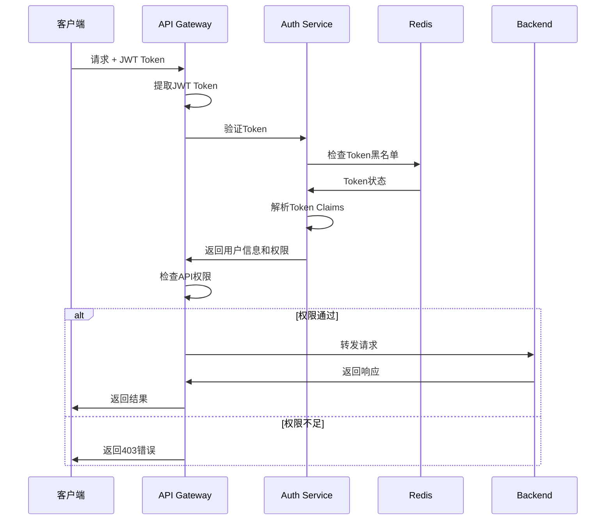

# Backend Architecture

## Service Architecture

### Controller Organization

```
backend/
├── cmd/                 # 应用入口
│   ├── api/            # API服务入口
│   └── worker/         # 后台任务入口
├── internal/           # 内部代码
│   ├── controller/     # HTTP控制器
│   ├── service/        # 业务服务层
│   ├── repository/     # 数据访问层
│   ├── model/          # 数据模型
│   └── middleware/     # 中间件
├── pkg/                # 可复用包
│   ├── auth/          # 认证组件
│   ├── cache/         # 缓存组件
│   └── database/      # 数据库组件
└── api/                # API文档
```

### Controller Template

```go
package controller

import (
    "context"
    "net/http"
    
    "github.com/gogf/gf/v2/frame/g"
    "github.com/gogf/gf/v2/net/ghttp"
    
    "mer-demo/internal/service"
    "mer-demo/internal/model"
)

type UserController struct {
    userService service.IUserService
}

func NewUserController() *UserController {
    return &UserController{
        userService: service.User(),
    }
}

func (c *UserController) Create(r *ghttp.Request) {
    var req *model.CreateUserRequest
    if err := r.Parse(&req); err != nil {
        r.Response.WriteJsonExit(g.Map{
            "code": 400,
            "message": err.Error(),
        })
        return
    }

    user, err := c.userService.Create(r.Context(), req)
    if err != nil {
        r.Response.WriteJsonExit(g.Map{
            "code": 500,
            "message": err.Error(),
        })
        return
    }

    r.Response.WriteJsonExit(g.Map{
        "code": 0,
        "data": user,
    })
}
```

## Database Architecture

### Schema Design

参见前面的Database Schema部分。

### Data Access Layer

```go
package repository

import (
    "context"
    "github.com/gogf/gf/v2/database/gdb"
    "mer-demo/internal/model"
)

type IUserRepository interface {
    Create(ctx context.Context, user *model.User) error
    GetByID(ctx context.Context, id uint64) (*model.User, error)
    GetByEmail(ctx context.Context, email string) (*model.User, error)
    Update(ctx context.Context, user *model.User) error
    Delete(ctx context.Context, id uint64) error
    List(ctx context.Context, req *model.ListUsersRequest) ([]*model.User, int, error)
}

type userRepository struct {
    db gdb.DB
}

func NewUserRepository() IUserRepository {
    return &userRepository{
        db: g.DB(),
    }
}

func (r *userRepository) Create(ctx context.Context, user *model.User) error {
    _, err := r.db.Model("users").Ctx(ctx).Insert(user)
    return err
}

func (r *userRepository) GetByID(ctx context.Context, id uint64) (*model.User, error) {
    var user *model.User
    err := r.db.Model("users").Ctx(ctx).Where("id", id).Scan(&user)
    return user, err
}
```

## Authentication and Authorization

### Auth Flow



### Middleware/Guards

```go
package middleware

import (
    "strings"
    "github.com/gogf/gf/v2/net/ghttp"
    "mer-demo/pkg/auth"
)

func AuthMiddleware() ghttp.HandlerFunc {
    return func(r *ghttp.Request) {
        // 跳过认证的路径
        if isPublicPath(r.URL.Path) {
            r.Middleware.Next()
            return
        }

        // 提取JWT Token
        authHeader := r.Header.Get("Authorization")
        if !strings.HasPrefix(authHeader, "Bearer ") {
            r.Response.WriteStatusExit(401, "Missing or invalid token")
            return
        }

        token := strings.TrimPrefix(authHeader, "Bearer ")
        
        // 验证Token
        claims, err := auth.ValidateToken(token)
        if err != nil {
            r.Response.WriteStatusExit(401, "Invalid token")
            return
        }

        // 设置用户上下文
        r.SetCtxVar("user_id", claims.UserID)
        r.SetCtxVar("tenant_id", claims.TenantID)
        r.SetCtxVar("permissions", claims.Permissions)

        r.Middleware.Next()
    }
}

func isPublicPath(path string) bool {
    publicPaths := []string{
        "/api/v1/auth/login",
        "/api/v1/auth/register", 
        "/api/v1/health",
    }
    
    for _, publicPath := range publicPaths {
        if strings.HasPrefix(path, publicPath) {
            return true
        }
    }
    return false
}
```
