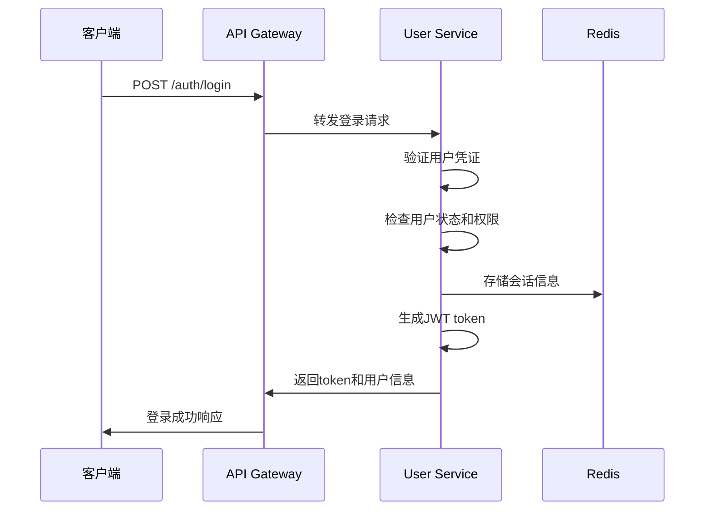
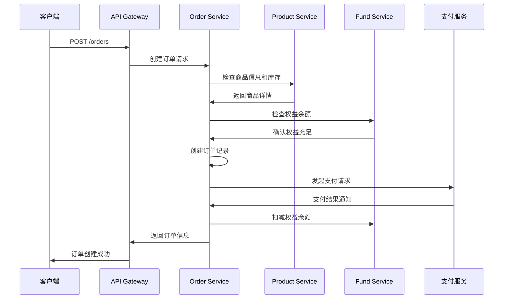

# Core Workflows

## 用户登录流程

```mermaid
sequenceDiagram
    participant C as 客户端
    participant G as API Gateway
    participant U as User Service
    participant R as Redis
    
    C->>G: POST /auth/login
    G->>U: 转发登录请求
    U->>U: 验证用户凭证
    U->>U: 检查用户状态和权限
    U->>R: 存储会话信息
    U->>U: 生成JWT token
    U->>G: 返回token和用户信息
    G->>C: 登录成功响应
```

## 订单创建流程

```mermaid
sequenceDiagram
    participant C as 客户端
    participant G as API Gateway
    participant O as Order Service
    participant P as Product Service
    participant F as Fund Service
    participant Pay as 支付服务
    
    C->>G: POST /orders
    G->>O: 创建订单请求
    O->>P: 检查商品信息和库存
    P->>O: 返回商品详情
    O->>F: 检查权益余额
    F->>O: 确认权益充足
    O->>O: 创建订单记录
    O->>Pay: 发起支付请求
    Pay->>O: 支付结果通知
    O->>F: 扣减权益余额
    O->>G: 返回订单信息
    G->>C: 订单创建成功
```
