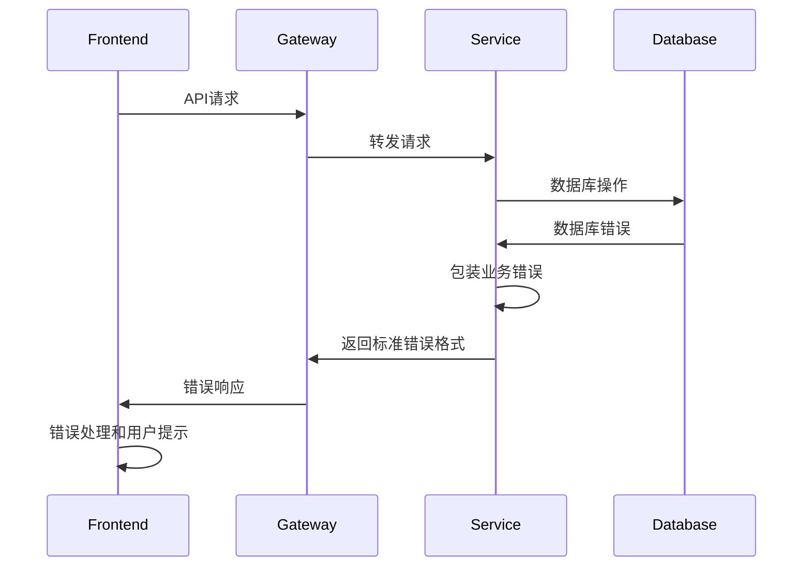

# Error Handling Strategy

## Error Flow



## Error Response Format

```typescript
interface ApiError {
  error: {
    code: string;          // 错误代码，如 "USER_NOT_FOUND"
    message: string;       // 用户友好的错误信息
    details?: Record<string, any>; // 详细错误信息
    timestamp: string;     // 错误发生时间
    requestId: string;     // 请求追踪ID
  };
}
```

## Frontend Error Handling

```typescript
// 全局错误处理器
export const globalErrorHandler = (error: ApiError) => {
  // 记录错误日志
  console.error('API Error:', error);
  
  // 根据错误类型显示不同提示
  switch (error.error.code) {
    case 'UNAUTHORIZED':
      // 清除认证信息，跳转登录
      useAuthStore.getState().logout();
      window.location.href = '/auth/login';
      break;
    case 'FORBIDDEN':
      toast.error('权限不足');
      break;
    case 'VALIDATION_ERROR':
      // 显示表单验证错误
      showValidationErrors(error.error.details);
      break;
    default:
      toast.error(error.error.message || '操作失败，请重试');
  }
};
```

## Backend Error Handling

```go
// 统一错误处理中间件
func ErrorHandlingMiddleware() ghttp.HandlerFunc {
    return ghttp.MiddlewareHandlerResponse(func(r *ghttp.Request) {
        r.Middleware.Next()
        
        // 获取响应错误
        if err := r.GetError(); err != nil {
            // 包装为标准错误格式
            errorResp := WrapError(err, r.GetRequestId())
            r.Response.ClearBuffer()
            r.Response.WriteJsonExit(errorResp)
        }
    })
}

// 错误包装器
func WrapError(err error, requestId string) *ApiError {
    var code string
    var message string
    
    // 根据错误类型确定错误代码
    switch {
    case errors.Is(err, gdb.ErrNoRows):
        code = "NOT_FOUND"
        message = "资源未找到"
    case errors.Is(err, context.DeadlineExceeded):
        code = "TIMEOUT"
        message = "请求超时"
    default:
        code = "INTERNAL_ERROR"
        message = "系统内部错误"
    }
    
    return &ApiError{
        Error: ErrorDetail{
            Code:      code,
            Message:   message,
            Timestamp: time.Now().Format(time.RFC3339),
            RequestId: requestId,
        },
    }
}
```
