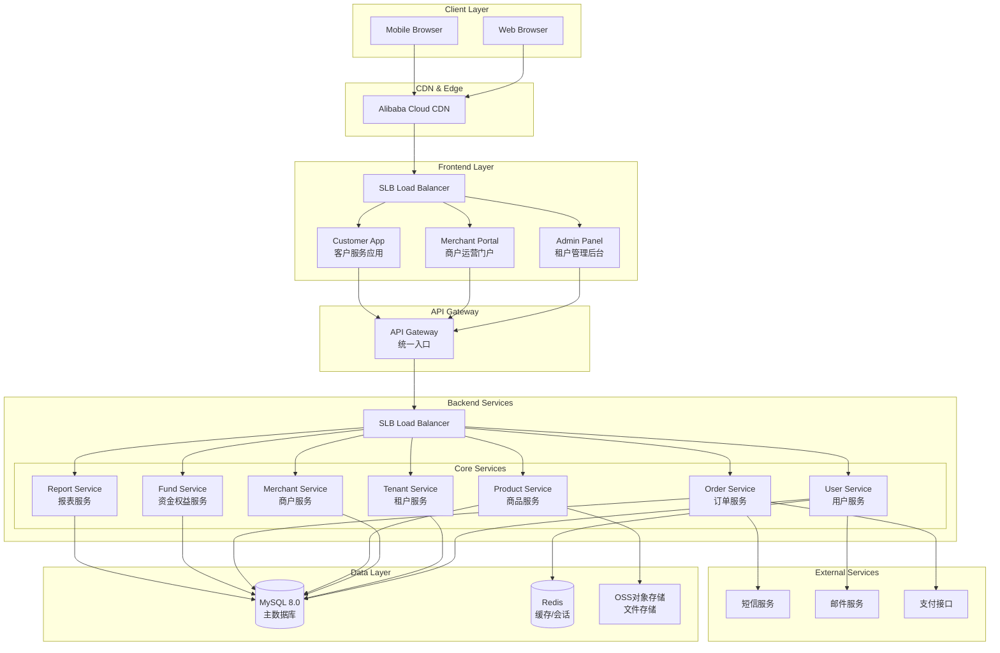

# High Level Architecture

## Technical Summary

多租户商户管理SaaS系统采用微服务架构，使用Go+GoFrame构建领域驱动的后端服务，React+Amis构建多层级管理前端。系统通过RESTful API实现前后端分离，使用MySQL存储业务数据，Redis提供缓存和会话管理。基于Docker容器化部署到云平台，支持水平扩展。该架构实现了三层B2B2C用户体系的完整业务流程，从租户管理到商户运营再到客户服务，确保数据隔离、权限控制和高性能访问。

## Platform and Infrastructure Choice

**Platform**: 阿里云  
**Key Services**: ECS集群、RDS MySQL、Redis、OSS对象存储、SLB负载均衡、CDN加速  
**Deployment Host and Regions**: 华东2（上海）主区域，华北2（北京）灾备区域

## Repository Structure

**Structure**: Monorepo  
**Monorepo Tool**: Go workspace (后端) + npm workspaces (前端)  
**Package Organization**: 按领域服务分离，共享代码独立包管理

## High Level Architecture Diagram

## Architectural Patterns

- **DDD (Domain-Driven Design)**: 按业务领域组织代码结构，清晰的聚合根和实体边界 - _理由:_ 复杂业务逻辑需要清晰的领域建模
- **微服务架构**: 按业务能力拆分独立服务，支持独立部署和扩展 - _理由:_ 三层用户架构需要不同的扩展策略和开发节奏
- **CQRS模式**: 读写分离，优化查询性能 - _理由:_ 报表查询和业务操作有不同的性能要求
- **事件驱动架构**: 服务间通过领域事件松耦合通信 - _理由:_ 减少服务间直接依赖，提高系统弹性
- **API网关模式**: 统一API入口，处理认证、限流和路由 - _理由:_ 简化前端调用，统一安全策略
- **Repository模式**: 抽象数据访问层，支持测试和数据源切换 - _理由:_ 提高代码可测试性和可维护性
- **多租户单库模式**: 通过tenant_id实现数据隔离 - _理由:_ 平衡数据隔离和运维复杂度
