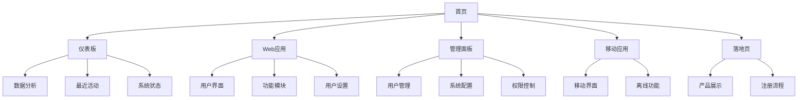
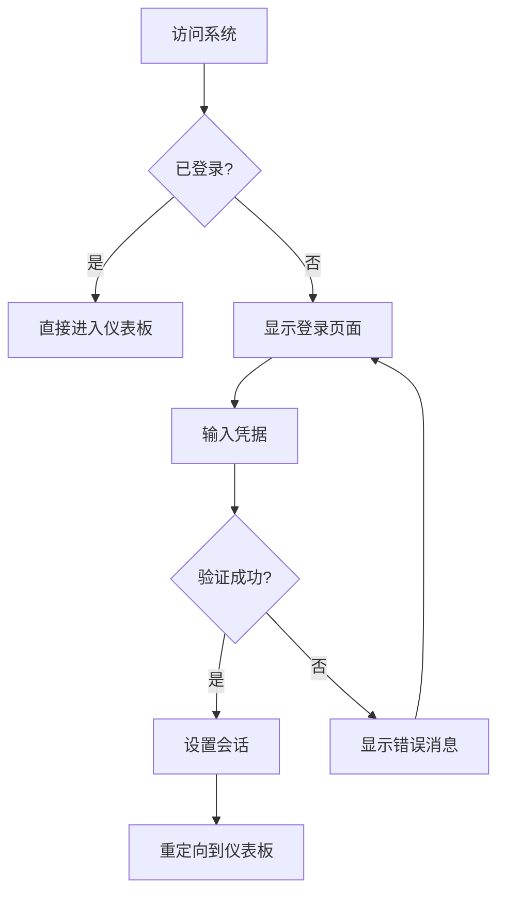
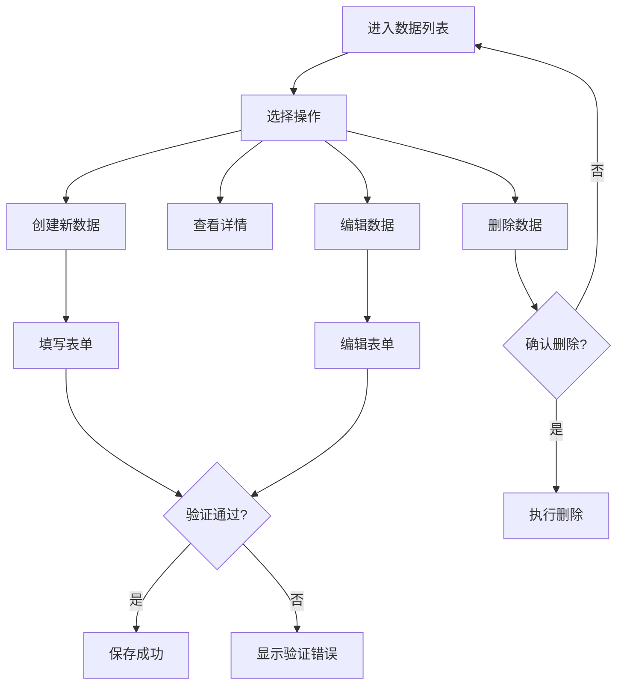

# mer-demo UI/UX 规范

本文档定义了 mer-demo 用户界面的用户体验目标、信息架构、用户流程和视觉设计规范。它为视觉设计和前端开发提供基础，确保连贯且以用户为中心的体验。

## 整体 UX 目标与原则

### 目标用户画像

**管理员用户**: 系统管理人员，需要控制和监督功能，重视效率和全面的系统访问权限  
**业务用户**: 日常操作人员，需要快速完成核心任务，优先考虑易用性和工作流程效率  
**最终用户**: 产品的主要使用者，重视直观的体验和快速响应

### 可用性目标

- **易学性**: 新用户可在 5 分钟内完成核心任务
- **使用效率**: 高频用户能以最少点击完成常用任务  
- **错误预防**: 对破坏性操作提供清晰的验证和确认
- **易记性**: 非频繁用户重新使用时无需重新学习

### 设计原则

1. **清晰胜过巧妙** - 优先清晰沟通而非美学创新
2. **渐进式披露** - 只在需要时显示需要的内容
3. **一致的模式** - 在整个应用中使用熟悉的 UI 模式
4. **即时反馈** - 每个操作都应有清晰、即时的响应
5. **默认可访问** - 从一开始就为所有用户设计

### 变更日志

| 日期 | 版本 | 描述 | 作者 |
|------|------|------|------|
| 2025-08-15 | 1.0 | 初始版本创建 | UX Expert |

## 信息架构 (IA)

### 站点地图 / 屏幕清单

### 导航结构

**主导航:** 基于角色的顶级导航，区分管理员、业务用户和最终用户视图

**次级导航:** 侧边栏导航，按功能模块组织，支持折叠和展开

**面包屑策略:** 层级面包屑显示当前位置，支持快速返回上级页面

## 用户流程

### 用户登录流程

**用户目标:** 安全快速地访问系统

**入口点:** 登录页面、首页重定向

**成功标准:** 用户在30秒内完成认证并进入主界面

#### 流程图

#### 边缘情况与错误处理:
- 网络连接失败时显示离线状态
- 多次登录失败后的账户锁定机制
- 密码重置流程的安全验证
- 会话过期的优雅处理

**注意:** 需要实现记住登录状态功能，提升用户体验

### 数据管理流程

**用户目标:** 高效地创建、读取、更新和删除数据

**入口点:** 各功能模块的数据列表页面

**成功标准:** 用户能在3步内完成基本CRUD操作

#### 流程图

#### 边缘情况与错误处理:
- 数据冲突时的合并策略
- 大量数据的分页和搜索
- 批量操作的进度反馈
- 误删除的撤销机制

**注意:** 实现自动保存草稿功能，防止数据丢失

## 线框图与模型

**主要设计文件:** 将在 Figma 中创建详细的视觉设计文件

### 关键屏幕布局

#### 仪表板主页

**目的:** 为用户提供系统概览和快速访问常用功能

**关键元素:**
- 顶部导航栏（logo、主菜单、用户信息）
- 左侧功能菜单（可折叠）
- 主内容区域（数据卡片、图表、快捷操作）
- 底部状态栏（系统状态、版本信息）

**交互说明:** 支持拖拽重排卡片，提供个性化布局选项

**设计文件引用:** 待创建 Figma 链接

#### 数据列表页面

**目的:** 高效浏览和管理大量数据项

**关键元素:**
- 搜索和筛选工具栏
- 可排序的数据表格
- 批量操作按钮
- 分页控件

**交互说明:** 支持列宽调整、列显示隐藏、数据导出功能

**设计文件引用:** 待创建 Figma 链接

#### 表单页面

**目的:** 提供直观的数据输入和编辑体验

**关键元素:**
- 分组的表单字段
- 实时验证反馈
- 保存/取消按钮
- 进度指示器（多步表单）

**交互说明:** 支持自动保存、键盘导航、智能默认值

**设计文件引用:** 待创建 Figma 链接

## 组件库 / 设计系统

**设计系统方法:** 创建自定义设计系统，基于原子设计理论，确保跨项目一致性

### 核心组件

#### 按钮组件

**目的:** 提供一致的操作触发器

**变体:** Primary、Secondary、Tertiary、Danger、Ghost

**状态:** Default、Hover、Active、Disabled、Loading

**使用指南:** Primary用于主要操作，每屏最多一个；Secondary用于次要操作；Danger用于破坏性操作需二次确认

#### 输入框组件

**目的:** 统一的数据输入界面

**变体:** Text、Email、Password、Number、TextArea、Select

**状态:** Default、Focus、Error、Disabled、Success

**使用指南:** 始终提供清晰的标签和帮助文本；错误状态需显示具体错误原因

#### 数据表格组件

**目的:** 高效展示和操作表格数据

**变体:** Basic、Sortable、Filterable、Selectable

**状态:** Loading、Empty、Error、Success

**使用指南:** 大数据集使用虚拟滚动；提供列配置和导出功能

#### 导航组件

**目的:** 提供清晰的页面间导航

**变体:** TopNav、SideNav、Breadcrumb、Tabs

**状态:** Active、Inactive、Disabled

**使用指南:** 导航层级不超过3层；活跃状态要明显可见

## 品牌与风格指南

### 视觉识别

**品牌指南:** 遵循企业级应用的专业性和可信度要求

### 色彩调色板

| 颜色类型 | 十六进制代码 | 使用场景 |
|----------|-------------|----------|
| Primary | #2563EB | 主要操作按钮、链接、品牌元素 |
| Secondary | #64748B | 次要信息、辅助元素 |
| Accent | #7C3AED | 强调、通知、特殊状态 |
| Success | #059669 | 成功反馈、确认操作 |
| Warning | #D97706 | 警告、重要提示 |
| Error | #DC2626 | 错误、破坏性操作 |
| Neutral | #374151, #9CA3AF, #F3F4F6 | 文本、边框、背景 |

### 字体排版

#### 字体族
- **主要字体:** Inter (现代、清晰的无衬线字体)
- **次要字体:** system-ui (系统默认字体作为备选)
- **等宽字体:** 'Fira Code' (代码显示)

#### 字体规模

| 元素 | 大小 | 粗细 | 行高 |
|------|------|------|------|
| H1 | 2.25rem | 700 | 1.2 |
| H2 | 1.875rem | 600 | 1.3 |
| H3 | 1.5rem | 600 | 1.4 |
| 正文 | 1rem | 400 | 1.6 |
| 小字 | 0.875rem | 400 | 1.5 |

### 图标

**图标库:** Heroicons (与 Tailwind CSS 生态系统一致)

**使用指南:** 统一使用 24px 大小，保持风格一致；重要操作使用实心图标，次要操作使用线性图标

### 间距与布局

**网格系统:** 12列响应式网格，基于CSS Grid和Flexbox

**间距规模:** 基于 4px 基准单位 (4, 8, 12, 16, 20, 24, 32, 40, 48, 64px)

## 可访问性要求

### 合规目标

**标准:** WCAG 2.1 AA级别合规

### 关键要求

**视觉:**
- 颜色对比度：正文文本至少4.5:1，大文本至少3:1
- 焦点指示器：明显的2px蓝色边框，支持高对比度模式
- 文本大小：支持200%缩放而不影响功能

**交互:**
- 键盘导航：所有交互元素可通过Tab键访问，支持焦点管理
- 屏幕阅读器支持：使用语义化HTML，提供适当的ARIA标签
- 触摸目标：最小44x44px触摸区域，避免误触

**内容:**
- 替代文本：所有图像提供描述性alt文本
- 标题结构：逻辑的H1-H6层级结构
- 表单标签：所有表单控件提供明确标签和错误说明

### 测试策略

使用自动化工具(axe-core)进行初步检测，配合手动键盘导航测试和屏幕阅读器测试(NVDA/JAWS)，确保真实可访问性体验

## 响应式策略

### 断点

| 断点 | 最小宽度 | 最大宽度 | 目标设备 |
|------|----------|----------|----------|
| Mobile | 320px | 767px | 手机、小屏设备 |
| Tablet | 768px | 1023px | 平板、小笔记本 |
| Desktop | 1024px | 1439px | 桌面、笔记本 |
| Wide | 1440px | - | 大屏显示器 |

### 适配模式

**布局变化:** 移动端单列布局，桌面端多列网格；导航菜单在小屏下折叠为汉堡菜单

**导航变化:** 移动端使用底部标签栏配合侧滑菜单；桌面端使用顶部导航+侧边栏

**内容优先级:** 移动端优先显示核心功能和内容，隐藏次要信息；提供快速访问常用操作

**交互变化:** 触摸友好的大按钮和手势支持；桌面端支持鼠标悬停和键盘快捷键

## 动画与微交互

### 动作原则

流畅自然的过渡效果，遵循物理运动规律；动画服务于可用性，提供状态反馈和引导用户注意力；尊重用户的动画偏好设置

### 关键动画

- **页面转换**: 淡入淡出过渡 (持续时间: 300ms, 缓动: ease-out)
- **按钮点击**: 轻微缩放反馈 (持续时间: 150ms, 缓动: ease-in-out)  
- **表单验证**: 错误字段红色边框闪烁 (持续时间: 200ms, 缓动: ease-in-out)
- **加载状态**: 骨架屏和进度指示器 (持续时间: 无限循环, 缓动: linear)
- **通知提示**: 从右侧滑入的消息卡片 (持续时间: 400ms, 缓动: ease-out)

## 性能考虑

### 性能目标

- **页面加载:** 首屏内容在2秒内显示完成
- **交互响应:** 用户操作反馈在100ms内显示  
- **动画帧率:** 保持60FPS的流畅动画体验

### 设计策略

实施懒加载和图片优化策略；使用CSS-in-JS和组件级代码分割；避免复杂的CSS选择器和大量DOM操作；优先使用CSS动画而非JavaScript动画

## 下一步

### 即时行动

1. 与产品团队和开发团队评审此规范文档
2. 在 Figma 中创建详细的视觉设计文件
3. 准备移交给前端架构师进行技术架构设计
4. 建立设计系统组件库的原型

### 设计移交检查清单

- [x] 所有用户流程已记录
- [x] 组件清单完整
- [x] 可访问性要求已定义  
- [x] 响应式策略清晰
- [x] 品牌指南已整合
- [x] 性能目标已建立

## 检查清单结果

UI/UX 检查清单将在创建后运行并在此处报告结果。

---

*文档创建于 2025-08-15，版本 1.0*