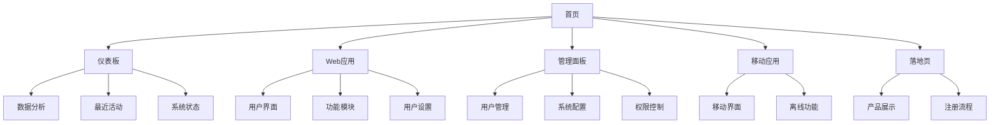

# 信息架构 (IA)

## 站点地图 / 屏幕清单

```mermaid
graph TD
    A[首页] --> B[仪表板]
    A --> C[Web应用]
    A --> D[管理面板]
    A --> E[移动应用]
    A --> F[落地页]
    B --> B1[数据分析]
    B --> B2[最近活动]
    B --> B3[系统状态]
    C --> C1[用户界面]
    C --> C2[功能模块]
    C --> C3[用户设置]
    D --> D1[用户管理]
    D --> D2[系统配置]
    D --> D3[权限控制]
    E --> E1[移动界面]
    E --> E2[离线功能]
    F --> F1[产品展示]
    F --> F2[注册流程]
```

## 导航结构

**主导航:** 基于角色的顶级导航，区分管理员、业务用户和最终用户视图

**次级导航:** 侧边栏导航，按功能模块组织，支持折叠和展开

**面包屑策略:** 层级面包屑显示当前位置，支持快速返回上级页面
