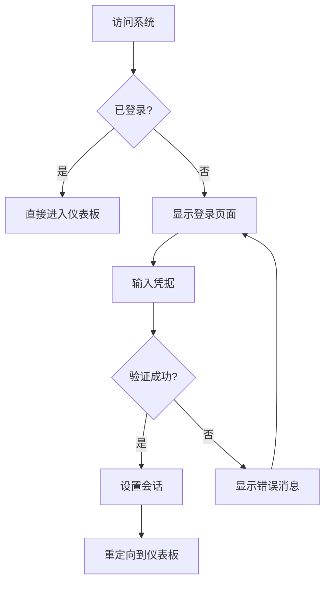
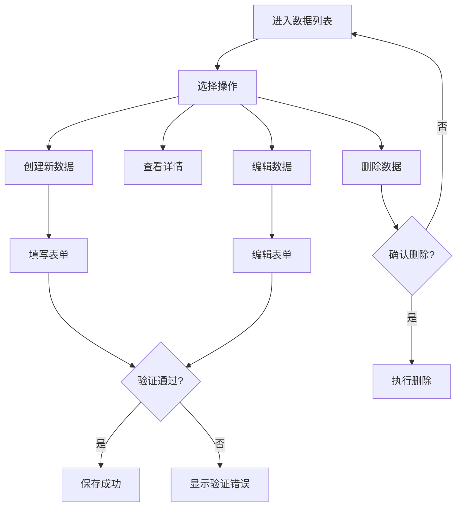

# 用户流程

## 用户登录流程

**用户目标:** 安全快速地访问系统

**入口点:** 登录页面、首页重定向

**成功标准:** 用户在30秒内完成认证并进入主界面

### 流程图

### 边缘情况与错误处理:
- 网络连接失败时显示离线状态
- 多次登录失败后的账户锁定机制
- 密码重置流程的安全验证
- 会话过期的优雅处理

**注意:** 需要实现记住登录状态功能，提升用户体验

## 数据管理流程

**用户目标:** 高效地创建、读取、更新和删除数据

**入口点:** 各功能模块的数据列表页面

**成功标准:** 用户能在3步内完成基本CRUD操作

### 流程图

### 边缘情况与错误处理:
- 数据冲突时的合并策略
- 大量数据的分页和搜索
- 批量操作的进度反馈
- 误删除的撤销机制

**注意:** 实现自动保存草稿功能，防止数据丢失
