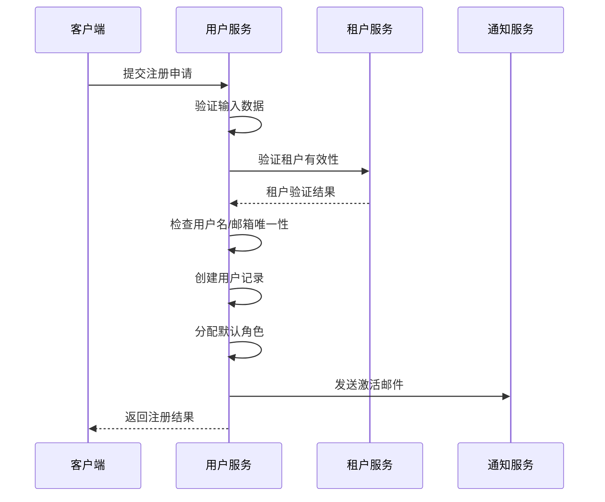
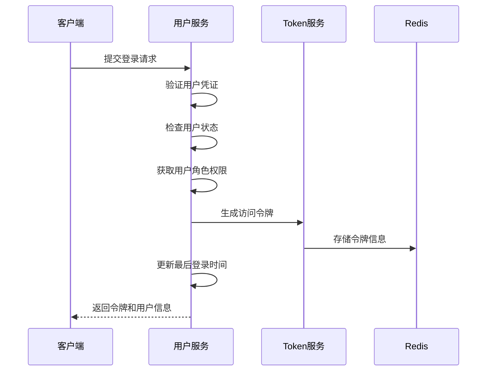
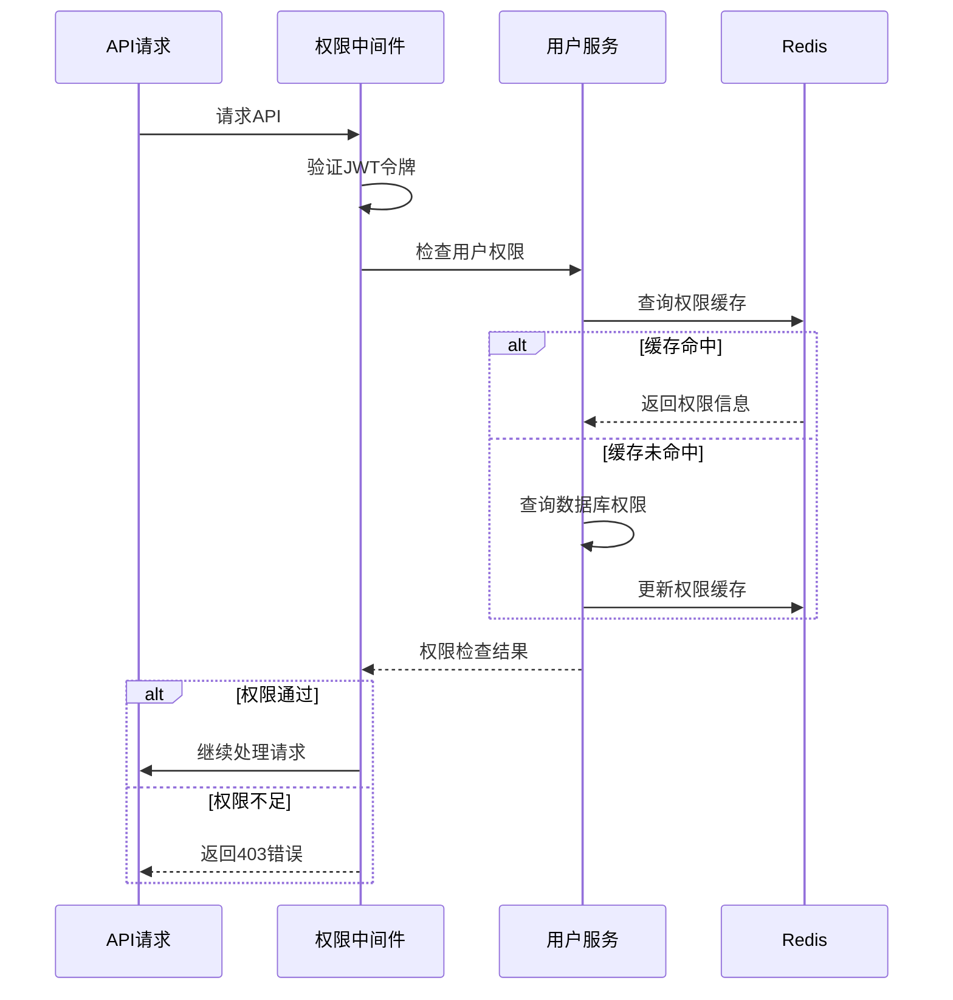

# 统一用户服务设计文档

## 概述

统一用户服务是整个多租户商户管理SaaS系统的核心服务之一，负责管理三层B2B2C架构中的所有用户角色：租户管理员、商户运营者、普通客户。通过统一的身份认证、授权和用户管理机制，确保系统的安全性和可扩展性。

## 用户角色架构

### 三层用户体系

```
租户管理员 (Tenant Admin)
    ├── 平台运营商
    └── 企业管理者
         │
         ├─── 商户运营者 (Merchant User)
         │    ├── 商户管理员 (Merchant Admin)
         │    └── 商户操作员 (Merchant Operator)
         │          │
         │          └─── 普通客户 (Customer)
         │               ├── 注册客户
         │               └── 访客用户
```

### 角色权限矩阵

| 角色 | 租户管理 | 商户管理 | 商品管理 | 订单管理 | 资金权益 | 报表查看 |
|------|----------|----------|----------|----------|----------|----------|
| 租户管理员 | ✅ | ✅ | ❌ | ✅ | ✅ | ✅ |
| 商户管理员 | ❌ | 自己 | ✅ | ✅ | 查看 | ✅ |
| 商户操作员 | ❌ | ❌ | ✅ | ✅ | 查看 | 部分 |
| 注册客户 | ❌ | ❌ | 查看 | 自己 | ❌ | 自己 |
| 访客用户 | ❌ | ❌ | 查看 | ❌ | ❌ | ❌ |

## 领域模型设计

### 用户聚合根 (User Aggregate)

```go
// 用户聚合根
type User struct {
    // 基础信息
    ID          uint64    `json:"id"`
    UUID        string    `json:"uuid"`          // 全局唯一标识
    Username    string    `json:"username"`       // 用户名
    Email       string    `json:"email"`         // 邮箱
    Phone       string    `json:"phone"`         // 手机号
    Password    string    `json:"-"`             // 密码哈希
    Avatar      string    `json:"avatar"`        // 头像
    Status      UserStatus `json:"status"`       // 用户状态
    
    // 多租户信息
    TenantID    uint64    `json:"tenant_id"`     // 所属租户
    
    // 角色信息
    Roles       []UserRole `json:"roles"`        // 用户角色列表
    
    // 扩展信息
    Profile     UserProfile `json:"profile"`      // 用户详细信息
    Settings    UserSettings `json:"settings"`    // 用户设置
    
    // 审计信息
    CreatedAt   time.Time `json:"created_at"`
    UpdatedAt   time.Time `json:"updated_at"`
    CreatedBy   uint64    `json:"created_by"`
    LastLoginAt *time.Time `json:"last_login_at"`
}

// 用户状态
type UserStatus int

const (
    UserStatusPending    UserStatus = iota + 1  // 待激活
    UserStatusActive                            // 活跃
    UserStatusSuspended                         // 暂停
    UserStatusDeactivated                       // 已停用
)

// 用户角色
type UserRole struct {
    ID          uint64    `json:"id"`
    UserID      uint64    `json:"user_id"`
    TenantID    uint64    `json:"tenant_id"`
    RoleType    RoleType  `json:"role_type"`     // 角色类型
    ResourceID  *uint64   `json:"resource_id"`   // 关联资源ID（如商户ID）
    Permissions []Permission `json:"permissions"` // 权限列表
    ExpiresAt   *time.Time `json:"expires_at"`   // 角色过期时间
    CreatedAt   time.Time `json:"created_at"`
}

// 角色类型
type RoleType int

const (
    RoleTenantAdmin     RoleType = iota + 1  // 租户管理员
    RoleMerchantAdmin                        // 商户管理员  
    RoleMerchantOperator                     // 商户操作员
    RoleCustomer                             // 普通客户
    RoleGuest                                // 访客用户
)

// 用户详细信息
type UserProfile struct {
    ID           uint64    `json:"id"`
    UserID       uint64    `json:"user_id"`
    RealName     string    `json:"real_name"`     // 真实姓名
    Gender       int       `json:"gender"`        // 性别
    Birthday     *time.Time `json:"birthday"`     // 生日
    Address      string    `json:"address"`       // 地址
    Company      string    `json:"company"`       // 公司
    Position     string    `json:"position"`      // 职位
    Description  string    `json:"description"`   // 个人描述
    UpdatedAt    time.Time `json:"updated_at"`
}

// 用户设置
type UserSettings struct {
    ID           uint64 `json:"id"`
    UserID       uint64 `json:"user_id"`
    Language     string `json:"language"`        // 语言偏好
    Timezone     string `json:"timezone"`        // 时区
    Theme        string `json:"theme"`           // 主题
    Notifications NotificationSettings `json:"notifications"` // 通知设置
    Privacy      PrivacySettings `json:"privacy"`            // 隐私设置
    UpdatedAt    time.Time `json:"updated_at"`
}
```

### 权限模型

```go
// 权限
type Permission struct {
    ID       uint64 `json:"id"`
    Code     string `json:"code"`        // 权限代码
    Name     string `json:"name"`        // 权限名称
    Resource string `json:"resource"`    // 资源
    Action   string `json:"action"`      // 操作
}

// 预定义权限常量
const (
    // 租户管理权限
    PermTenantManage    = "tenant:manage"
    PermTenantView      = "tenant:view"
    
    // 商户管理权限
    PermMerchantManage  = "merchant:manage"
    PermMerchantView    = "merchant:view"
    PermMerchantCreate  = "merchant:create"
    
    // 商品管理权限
    PermProductManage   = "product:manage"
    PermProductView     = "product:view"
    PermProductCreate   = "product:create"
    
    // 订单管理权限
    PermOrderManage     = "order:manage"
    PermOrderView       = "order:view"
    PermOrderProcess    = "order:process"
    
    // 资金权益权限
    PermFundsManage     = "funds:manage"
    PermFundsView       = "funds:view"
    PermRightsAllocate  = "rights:allocate"
    
    // 报表权限
    PermReportsView     = "reports:view"
    PermReportsExport   = "reports:export"
)
```

## 数据库设计

### 用户相关表结构

```sql
-- 用户主表
CREATE TABLE users (
    id BIGINT UNSIGNED AUTO_INCREMENT PRIMARY KEY,
    uuid VARCHAR(36) NOT NULL UNIQUE COMMENT '全局唯一标识',
    username VARCHAR(50) NOT NULL COMMENT '用户名',
    email VARCHAR(100) NOT NULL COMMENT '邮箱',
    phone VARCHAR(20) COMMENT '手机号',
    password VARCHAR(255) NOT NULL COMMENT '密码哈希',
    avatar VARCHAR(255) COMMENT '头像URL',
    status TINYINT NOT NULL DEFAULT 1 COMMENT '状态:1待激活,2活跃,3暂停,4停用',
    tenant_id BIGINT UNSIGNED NOT NULL COMMENT '租户ID',
    created_at TIMESTAMP DEFAULT CURRENT_TIMESTAMP,
    updated_at TIMESTAMP DEFAULT CURRENT_TIMESTAMP ON UPDATE CURRENT_TIMESTAMP,
    created_by BIGINT UNSIGNED COMMENT '创建人',
    last_login_at TIMESTAMP NULL COMMENT '最后登录时间',
    INDEX idx_tenant_id (tenant_id),
    INDEX idx_email (email),
    INDEX idx_phone (phone),
    INDEX idx_username (username)
) COMMENT='用户表';

-- 用户角色表
CREATE TABLE user_roles (
    id BIGINT UNSIGNED AUTO_INCREMENT PRIMARY KEY,
    user_id BIGINT UNSIGNED NOT NULL COMMENT '用户ID',
    tenant_id BIGINT UNSIGNED NOT NULL COMMENT '租户ID',
    role_type TINYINT NOT NULL COMMENT '角色类型:1租户管理员,2商户管理员,3商户操作员,4客户,5访客',
    resource_id BIGINT UNSIGNED COMMENT '关联资源ID（商户ID等）',
    expires_at TIMESTAMP NULL COMMENT '角色过期时间',
    created_at TIMESTAMP DEFAULT CURRENT_TIMESTAMP,
    INDEX idx_user_id (user_id),
    INDEX idx_tenant_id (tenant_id),
    INDEX idx_role_type (role_type),
    INDEX idx_resource_id (resource_id)
) COMMENT='用户角色表';

-- 权限表
CREATE TABLE permissions (
    id BIGINT UNSIGNED AUTO_INCREMENT PRIMARY KEY,
    code VARCHAR(50) NOT NULL UNIQUE COMMENT '权限代码',
    name VARCHAR(100) NOT NULL COMMENT '权限名称',
    resource VARCHAR(50) NOT NULL COMMENT '资源',
    action VARCHAR(50) NOT NULL COMMENT '操作',
    description TEXT COMMENT '权限描述',
    created_at TIMESTAMP DEFAULT CURRENT_TIMESTAMP
) COMMENT='权限表';

-- 角色权限关联表
CREATE TABLE role_permissions (
    id BIGINT UNSIGNED AUTO_INCREMENT PRIMARY KEY,
    user_role_id BIGINT UNSIGNED NOT NULL COMMENT '用户角色ID',
    permission_id BIGINT UNSIGNED NOT NULL COMMENT '权限ID',
    granted_by BIGINT UNSIGNED COMMENT '授权人',
    created_at TIMESTAMP DEFAULT CURRENT_TIMESTAMP,
    UNIQUE KEY uk_role_permission (user_role_id, permission_id),
    INDEX idx_user_role_id (user_role_id),
    INDEX idx_permission_id (permission_id)
) COMMENT='角色权限关联表';

-- 用户详细信息表
CREATE TABLE user_profiles (
    id BIGINT UNSIGNED AUTO_INCREMENT PRIMARY KEY,
    user_id BIGINT UNSIGNED NOT NULL UNIQUE COMMENT '用户ID',
    real_name VARCHAR(50) COMMENT '真实姓名',
    gender TINYINT COMMENT '性别:1男,2女,0未知',
    birthday DATE COMMENT '生日',
    address VARCHAR(255) COMMENT '地址',
    company VARCHAR(100) COMMENT '公司',
    position VARCHAR(50) COMMENT '职位',
    description TEXT COMMENT '个人描述',
    updated_at TIMESTAMP DEFAULT CURRENT_TIMESTAMP ON UPDATE CURRENT_TIMESTAMP,
    INDEX idx_user_id (user_id)
) COMMENT='用户详细信息表';

-- 用户设置表
CREATE TABLE user_settings (
    id BIGINT UNSIGNED AUTO_INCREMENT PRIMARY KEY,
    user_id BIGINT UNSIGNED NOT NULL UNIQUE COMMENT '用户ID',
    language VARCHAR(10) DEFAULT 'zh-CN' COMMENT '语言偏好',
    timezone VARCHAR(50) DEFAULT 'Asia/Shanghai' COMMENT '时区',
    theme VARCHAR(20) DEFAULT 'default' COMMENT '主题',
    notification_email BOOLEAN DEFAULT TRUE COMMENT '邮件通知',
    notification_sms BOOLEAN DEFAULT TRUE COMMENT '短信通知',
    notification_system BOOLEAN DEFAULT TRUE COMMENT '系统通知',
    privacy_profile BOOLEAN DEFAULT TRUE COMMENT '资料可见性',
    privacy_activity BOOLEAN DEFAULT FALSE COMMENT '活动可见性',
    updated_at TIMESTAMP DEFAULT CURRENT_TIMESTAMP ON UPDATE CURRENT_TIMESTAMP,
    INDEX idx_user_id (user_id)
) COMMENT='用户设置表';
```

## 服务接口设计

### 用户管理接口

```go
// 用户服务接口
type UserService interface {
    // 用户注册
    Register(ctx context.Context, req *RegisterRequest) (*UserResponse, error)
    
    // 用户登录
    Login(ctx context.Context, req *LoginRequest) (*LoginResponse, error)
    
    // 用户登出
    Logout(ctx context.Context, userID uint64) error
    
    // 获取用户信息
    GetUser(ctx context.Context, userID uint64) (*UserResponse, error)
    
    // 更新用户信息
    UpdateUser(ctx context.Context, req *UpdateUserRequest) (*UserResponse, error)
    
    // 修改密码
    ChangePassword(ctx context.Context, req *ChangePasswordRequest) error
    
    // 重置密码
    ResetPassword(ctx context.Context, req *ResetPasswordRequest) error
    
    // 用户状态管理
    ActivateUser(ctx context.Context, userID uint64) error
    SuspendUser(ctx context.Context, userID uint64) error
    DeactivateUser(ctx context.Context, userID uint64) error
    
    // 用户列表查询
    ListUsers(ctx context.Context, req *ListUsersRequest) (*ListUsersResponse, error)
}

// 角色权限服务接口
type RolePermissionService interface {
    // 分配角色
    AssignRole(ctx context.Context, req *AssignRoleRequest) error
    
    // 撤销角色
    RevokeRole(ctx context.Context, userRoleID uint64) error
    
    // 获取用户角色
    GetUserRoles(ctx context.Context, userID uint64) ([]UserRole, error)
    
    // 检查权限
    HasPermission(ctx context.Context, userID uint64, permission string, resourceID *uint64) (bool, error)
    
    // 获取用户权限列表
    GetUserPermissions(ctx context.Context, userID uint64) ([]Permission, error)
    
    // 权限验证中间件
    RequirePermission(permission string) middleware.HandlerFunc
}
```

### API接口定义

```go
// 注册请求
type RegisterRequest struct {
    Username  string `json:"username" validate:"required,min=3,max=50"`
    Email     string `json:"email" validate:"required,email"`
    Phone     string `json:"phone" validate:"omitempty,phone"`
    Password  string `json:"password" validate:"required,min=8"`
    TenantID  uint64 `json:"tenant_id" validate:"required"`
    RoleType  RoleType `json:"role_type" validate:"required"`
    ResourceID *uint64 `json:"resource_id,omitempty"` // 关联商户ID
    InviteCode string `json:"invite_code,omitempty"` // 邀请码
}

// 登录请求
type LoginRequest struct {
    LoginType LoginType `json:"login_type"`         // 登录类型
    Username  string    `json:"username,omitempty"` // 用户名
    Email     string    `json:"email,omitempty"`    // 邮箱
    Phone     string    `json:"phone,omitempty"`    // 手机号
    Password  string    `json:"password" validate:"required"`
    TenantID  uint64    `json:"tenant_id" validate:"required"`
}

type LoginType int

const (
    LoginByUsername LoginType = iota + 1
    LoginByEmail
    LoginByPhone
)

// 登录响应
type LoginResponse struct {
    AccessToken  string       `json:"access_token"`
    RefreshToken string       `json:"refresh_token"`
    TokenType    string       `json:"token_type"`
    ExpiresIn    int64        `json:"expires_in"`
    User         UserResponse `json:"user"`
}

// 用户响应
type UserResponse struct {
    ID          uint64       `json:"id"`
    UUID        string       `json:"uuid"`
    Username    string       `json:"username"`
    Email       string       `json:"email"`
    Phone       string       `json:"phone"`
    Avatar      string       `json:"avatar"`
    Status      UserStatus   `json:"status"`
    TenantID    uint64       `json:"tenant_id"`
    Roles       []UserRole   `json:"roles"`
    Profile     *UserProfile `json:"profile,omitempty"`
    Settings    *UserSettings `json:"settings,omitempty"`
    Permissions []string     `json:"permissions"`
    CreatedAt   time.Time    `json:"created_at"`
    LastLoginAt *time.Time   `json:"last_login_at,omitempty"`
}
```

## 身份认证与授权

### JWT Token设计

```go
// JWT Claims
type UserClaims struct {
    UserID      uint64   `json:"user_id"`
    UUID        string   `json:"uuid"`
    Username    string   `json:"username"`
    TenantID    uint64   `json:"tenant_id"`
    Roles       []RoleInfo `json:"roles"`
    Permissions []string `json:"permissions"`
    jwt.RegisteredClaims
}

type RoleInfo struct {
    RoleType   RoleType `json:"role_type"`
    ResourceID *uint64  `json:"resource_id,omitempty"`
}

// Token管理服务
type TokenService interface {
    // 生成访问令牌
    GenerateAccessToken(user *User) (string, error)
    
    // 生成刷新令牌
    GenerateRefreshToken(userID uint64) (string, error)
    
    // 验证令牌
    ValidateToken(tokenString string) (*UserClaims, error)
    
    // 刷新令牌
    RefreshToken(refreshToken string) (*LoginResponse, error)
    
    // 撤销令牌
    RevokeToken(tokenString string) error
}
```

### 权限验证中间件

```go
// 权限验证中间件
func (s *rolePermissionService) RequirePermission(permission string) gin.HandlerFunc {
    return func(c *gin.Context) {
        // 从JWT token中获取用户信息
        claims, exists := c.Get("user_claims")
        if !exists {
            c.JSON(401, gin.H{"error": "未授权"})
            c.Abort()
            return
        }
        
        userClaims := claims.(*UserClaims)
        
        // 检查用户权限
        hasPermission, err := s.HasPermission(c, userClaims.UserID, permission, nil)
        if err != nil {
            c.JSON(500, gin.H{"error": "权限检查失败"})
            c.Abort()
            return
        }
        
        if !hasPermission {
            c.JSON(403, gin.H{"error": "权限不足"})
            c.Abort()
            return
        }
        
        c.Next()
    }
}

// 租户隔离中间件
func TenantIsolationMiddleware() gin.HandlerFunc {
    return func(c *gin.Context) {
        claims, exists := c.Get("user_claims")
        if !exists {
            c.JSON(401, gin.H{"error": "未授权"})
            c.Abort()
            return
        }
        
        userClaims := claims.(*UserClaims)
        
        // 将租户ID注入上下文
        c.Set("tenant_id", userClaims.TenantID)
        c.Next()
    }
}
```

## 业务流程设计

### 用户注册流程



### 用户登录流程



### 权限检查流程



## 安全性设计

### 密码安全

```go
// 密码加密服务
type PasswordService interface {
    // 密码哈希
    HashPassword(password string) (string, error)
    
    // 验证密码
    VerifyPassword(hashedPassword, password string) bool
    
    // 密码强度检查
    CheckPasswordStrength(password string) error
    
    // 生成随机密码
    GenerateRandomPassword(length int) string
}

// 密码策略配置
type PasswordPolicy struct {
    MinLength      int  `json:"min_length"`       // 最小长度
    RequireUpper   bool `json:"require_upper"`    // 需要大写字母
    RequireLower   bool `json:"require_lower"`    // 需要小写字母
    RequireDigits  bool `json:"require_digits"`   // 需要数字
    RequireSymbols bool `json:"require_symbols"`  // 需要特殊字符
    MaxAge         int  `json:"max_age"`          // 密码有效期（天）
    HistoryCount   int  `json:"history_count"`    // 密码历史记录数
}
```

### 访问控制

```go
// 访问控制配置
type AccessControl struct {
    MaxLoginAttempts int           `json:"max_login_attempts"` // 最大登录尝试次数
    LockoutDuration  time.Duration `json:"lockout_duration"`   // 锁定时间
    TokenExpiration  time.Duration `json:"token_expiration"`   // Token过期时间
    RefreshExpiration time.Duration `json:"refresh_expiration"` // 刷新Token过期时间
    MaxSessions      int           `json:"max_sessions"`       // 最大同时会话数
}

// 登录限制服务
type LoginLimitService interface {
    // 记录登录尝试
    RecordLoginAttempt(ctx context.Context, identifier string, success bool) error
    
    // 检查是否被锁定
    IsLocked(ctx context.Context, identifier string) (bool, time.Time, error)
    
    // 解锁账户
    UnlockAccount(ctx context.Context, identifier string) error
    
    // 清除登录记录
    ClearLoginAttempts(ctx context.Context, identifier string) error
}
```

## 缓存策略

### 用户信息缓存

```go
// 缓存键定义
const (
    UserCachePrefix       = "user:"
    UserRolesCachePrefix  = "user:roles:"
    UserPermsCachePrefix  = "user:perms:"
    TokenBlacklistPrefix  = "token:blacklist:"
)

// 缓存服务
type UserCacheService interface {
    // 缓存用户信息
    SetUser(ctx context.Context, user *User) error
    
    // 获取用户信息
    GetUser(ctx context.Context, userID uint64) (*User, error)
    
    // 删除用户缓存
    DeleteUser(ctx context.Context, userID uint64) error
    
    // 缓存用户权限
    SetUserPermissions(ctx context.Context, userID uint64, permissions []string) error
    
    // 获取用户权限
    GetUserPermissions(ctx context.Context, userID uint64) ([]string, error)
    
    // 令牌黑名单
    BlacklistToken(ctx context.Context, token string, expiration time.Duration) error
    IsTokenBlacklisted(ctx context.Context, token string) (bool, error)
}
```

## 监控与日志

### 操作审计

```go
// 审计日志
type AuditLog struct {
    ID          uint64    `json:"id"`
    UserID      uint64    `json:"user_id"`
    TenantID    uint64    `json:"tenant_id"`
    Action      string    `json:"action"`       // 操作类型
    Resource    string    `json:"resource"`     // 资源类型
    ResourceID  string    `json:"resource_id"`  // 资源ID
    Details     string    `json:"details"`      // 详细信息
    IP          string    `json:"ip"`           // IP地址
    UserAgent   string    `json:"user_agent"`   // 用户代理
    Result      string    `json:"result"`       // 操作结果
    CreatedAt   time.Time `json:"created_at"`
}

// 审计服务
type AuditService interface {
    // 记录审计日志
    LogAction(ctx context.Context, log *AuditLog) error
    
    // 查询审计日志
    QueryLogs(ctx context.Context, req *AuditQueryRequest) (*AuditQueryResponse, error)
}
```

### 性能监控

```go
// 性能指标
type UserServiceMetrics struct {
    // 登录相关指标
    LoginAttempts    prometheus.CounterVec   // 登录尝试次数
    LoginSuccesses   prometheus.CounterVec   // 登录成功次数
    LoginFailures    prometheus.CounterVec   // 登录失败次数
    LoginDuration    prometheus.HistogramVec // 登录耗时
    
    // 用户相关指标
    ActiveUsers      prometheus.GaugeVec     // 活跃用户数
    UserRegistrations prometheus.CounterVec  // 用户注册数
    
    // API相关指标
    APIRequests      prometheus.CounterVec   // API请求次数
    APILatency       prometheus.HistogramVec // API延迟
    APIErrors        prometheus.CounterVec   // API错误次数
}
```

## 部署与运维

### 配置管理

```go
// 用户服务配置
type UserServiceConfig struct {
    // 数据库配置
    Database struct {
        DSN             string        `yaml:"dsn"`
        MaxOpenConns    int           `yaml:"max_open_conns"`
        MaxIdleConns    int           `yaml:"max_idle_conns"`
        ConnMaxLifetime time.Duration `yaml:"conn_max_lifetime"`
    } `yaml:"database"`
    
    // Redis配置
    Redis struct {
        Addr     string `yaml:"addr"`
        Password string `yaml:"password"`
        DB       int    `yaml:"db"`
    } `yaml:"redis"`
    
    // JWT配置
    JWT struct {
        SecretKey        string        `yaml:"secret_key"`
        AccessExpiration time.Duration `yaml:"access_expiration"`
        RefreshExpiration time.Duration `yaml:"refresh_expiration"`
    } `yaml:"jwt"`
    
    // 密码策略
    PasswordPolicy PasswordPolicy `yaml:"password_policy"`
    
    // 访问控制
    AccessControl AccessControl `yaml:"access_control"`
}
```

### 健康检查

```go
// 健康检查服务
type HealthCheckService interface {
    // 检查数据库连接
    CheckDatabase(ctx context.Context) error
    
    // 检查Redis连接
    CheckRedis(ctx context.Context) error
    
    // 检查依赖服务
    CheckDependencies(ctx context.Context) error
    
    // 获取健康状态
    GetHealthStatus(ctx context.Context) *HealthStatus
}

type HealthStatus struct {
    Status      string            `json:"status"`      // healthy, unhealthy, degraded
    Timestamp   time.Time         `json:"timestamp"`
    Version     string            `json:"version"`
    Services    map[string]string `json:"services"`    // 依赖服务状态
    Metrics     map[string]interface{} `json:"metrics"` // 关键指标
}
```

## 总结

统一用户服务设计的核心特点：

1. **统一身份认证**：支持多种登录方式，统一的JWT令牌管理
2. **灵活权限控制**：基于RBAC的多层级权限模型，支持细粒度控制
3. **多租户隔离**：完整的数据隔离和权限隔离机制
4. **安全性保障**：密码策略、访问控制、审计日志等安全措施
5. **高性能设计**：合理的缓存策略，支持大规模并发访问
6. **可扩展架构**：微服务设计，易于水平扩展和功能扩展

该设计能够满足多租户商户管理SaaS系统的所有用户管理需求，为系统的安全稳定运行提供坚实基础。